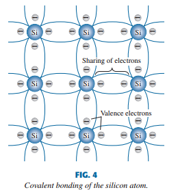

# Chapter 1, Semiconductor diodes

# 1.2 Semiconductor materials

Generally, semiconductor materials fall in 2 categories, _single crystal and compound_. Single crystal semiconductors
such as Germanium(Ge) and Silicon (Si) have a repetetive crystal structure.

# 1.3 Covalent bonding and intrinsic materials

As you can see in fig 3, silicon has 14 electrons, Ge has 32, Ga has 31 and Ar has 33.
The outer shell contains the **valence electrons**.
Silicon and Germanium have 4, Galium has 3, Arsenic has 5.
Atoms with 4 valence electrons are _tetravalent_, with 3 are _trivalent_ and with 5 are _pentavalent._

_Valence_ is used to indicate that the potential required to remove one of the electrons from the structure is
significantly lower than the energy required to remove any other electron from the structure.

In a pure silicon or germanium crystal the 4 valence electrons of one atom form a bonding arangement with 4 adjacent atoms,
as shown in fig 4.

**The bonding of atoms, strengthened by the sharing of electrons, is called covalent bonding**

Because GaAs is a compound semiconductor, there's sharing between 2 different atoms, as shown in fig. 5. Each atom is
surrounded by atoms of a complementary type. There is still sharing of electrons like Ge and Si, but now 5 electrons are
provided by As and 3 by Ga.

Altho the covalent bond results in a stronger bond between the valence electrons and their parent atom, its still possible
for the valence electrons to absorb enough kinetic energy from external natural causes to break the covalent bond and
assume the **"free"** state. Free revers to any electron that has seperated from the fixed lattice structure and is very
sensitive to any applied electric fields such as a difference in voltage potential by a v. source. External causes include
effects such as light energy and thermal energy. at room temperature, there are approx. $1.5 \cdot 10^{10}$ free carriers
in 1 $cm^3$ of _intrinsic_ silicon material.

**The term intrinsic is applied to any semiconductor material that has been carefully refined to reduce the number of
impurities to a very low level, essentially as pure as can be made available through modern technology**

Below are tables containing the intrinsic carriers $n_i$ and relative mobility $\mu_n$ of various materials. The higher
response time of GaAs is due to the significantly higher mobility factor.

One important difference between conductors and semiconductors is the response to heat. For conductors, resistance
increases as temperature increases, whereas the inverse is true for semiconductors, because more valence electrons absorb
enough thermal energy to break the covalent bond and increase the number of free carriers.

---

## Energy levels

Within the atomic structure of every _isolated_ atom there are specific energy levels associated with each shell and
orbiting electron, and these are also different for each element.

**In general, the farther an electron is from the nucleus, the higher is the energy state, and any
electron that has left its parent atom has a higher energy state than any electron in
the atomic structure**
Note that only specific energy levels can exist for electrons in the atomic structure of an isolated atom. This results
in a series of gaps between allowed energy levels where carriers are not permitted.
However, as the atoms of a material are brought closer together to gorm the lattice structure, there is an interaction
between atoms, which will result in the electrons f a particular shell of an atom having slightly different energy levels
from electrons in the same orbit of an adjoining atom. The result is an expansion of the fixed, discrete energy levels of
the valence electrons of Fig. 6a to bands as shown in Fig. 6b. In other words, the valence electrons in a silicon material
can have varying energy levels as long as they fall within the band of Fig. 6b. Figure 6b clearly reveals that there is
a minimum energy level associated with electrons in the conduction band and a maximum energy level of electrons bound to
the valence shell of the atom. Between the two is an energy gap that the electron in the valence band must overcome to
become a free carrier. That energy gap is different for Ge, Si, and GaAs

**An electron in the valence band of silicon must absorb more energy than one in the valence band of germanium to become
a free carrier. Similarly, an electron in the valence band of gallium arsenide must gain more energy than one in silicon or
germanium to enter the conduction band**

As the energy gap gets smaller, the sensitivity to heat and light increases.

The energy gap also reveals which elements are useful in the construction of LEDs. The bigger the gap, the higher the
chance of the energy being released as light.

The units of measurement for energy levels is _electron volt (eV)_.
This is appropriate, because W = QV (Q is charge).

Substituting the charge of 1 electron and a potential of 1V results in the energy level reffered to as one eV.

$$
\begin{aligned}
W &= QV \\
&= (1.6 \cdot 10^{-19} C \cdot 1 V) \\
&= 1.6 \cdot 10^{-19} J
\end{aligned}
$$

# 1.5 n-type and p-type materials

**A semiconductor material that's been subjected to the doping process(altering substrate material by adding special
impurities) is called an extrinsic material**

There are 2 extrnsic materials that are very important, the p and n type.

## n-type material

n-type is made by adding atoms that have 5 valence electrons (pentavalent), such as _antimony, arsenic, phosphorus_ The
resulting effect is illustrated in figure 7. There are still 5 covalent bonds, but an additional 5th electron from the
impurity. this one is relatively free to move around within the newly formed n-type material.

**Diffused impurities with 5 valence electrons are called donor atoms**
It's important to realize that eventho there are free carriers, the n-type material is still electrically neutral since
**n protons = n electrons**

The effect of the doping process on the relative conductivity can be described using the diagram in fig. 8. Note how the
donor level appears in the forbidden band with an $E_g$ significantly less than that of the intrinsic material. Those free
electrons sit at this energy level and absorb energy easier to go to the conduction band. This results in increased
conductivity of the material. At room temp, pure Si material has ine free electron per every $10^{12}$ atoms, compared to 1
in $10^7$ atoms for n-type, meaning that the carrier concentration level has increased by $10^5$

## p-type material

The p-type material is formed by doping tthe substrate with trivalent materials, such as boron, gallium and indium.
In fig 9 you can see how there's now an insufficient number of electrons to complete the covalent bonds. The resulting
vacancy is called a _hole_ and is represented by a small circle or plus, indicating the absence of a neg. charge. since
the resulting vacancy will readily accept a free electron, **The diffused impurities with 3 valence electrons are called
the acceptor atoms** The resulting p-type material is also electrically neutral for the same reason as the n-type.

## Electron vs hole flow

The effect of the hole on conduction is shown in fig. 10. if a valence electron aquires enough energy to break its covalent
bond and fills the void created by a hole, then there will be a hole created in the covalent bond that released that electron.
The direction of the hole flow is called the **conventional flow**

## Majority vs minority carriers

**In an n-type material (Fig. 11a) the electron is called the majority carrier and the hole
the minority carrier, while in the p-type material the reverse is true**

# 1.6 Semiconductor diode

Now that we have the n and p type materials, we can construct the first solid state electronic device, the diode.
This is done by simply joining an n- and p-type material together.

## No applied bias (V = 0v)

At the place where the 2 materials joined, the electrons and holes will combine, resulting in a lack of free carriers in
the region near the junction, as shown in fig 12.

**The region where the 2 readily combine is the depletion region, because the free carriers are depleted in this region**

When the leads are connected to the ends of each material, a 2 terminal device is the result. There are 3 options available
no bias, forward bias and reverse bias. the term _bias_ refers to the application of an external voltage across the diode.
under the no bias conduction, any minority carriers of the n-type close to the junction will pass quickly to the p-type,
same for the p-type to the n-type. see fig 12 for the carrier flow and everything in no bias condition.

**In the absence of an applied bias across a semiconductor diode, the net flow of charge in one direction is zero.**

## Reverse bias condition ($V_d < 0 V$)

if the positive terminal is connected to the n-type and neg. to the p-type, we talk about reverse bias.
**The result is that the depletion region gets larger. The current that exists under reverse-bias conditions is called
reverse saturation current and is represented by $I_s$, and is typically a few mA**

## Forward bias

Is archieved by applying he + terminal to the p-type and - terminal to the n-type.
The $V_D$ will make the electrons in n-type and holes in p-type recombine near the junction, thus reducing the depletion
zone. The minority flow will not change much, but there will be a significant increase of the majority flow across the
junction. As the $V_D$ increases, the depletion zone will decrease till a flood of electrons can pass the junction,
resulting in an exponential increase of the current, as noted in fig 15.

## Shockley's equation

The general characteristics of diodes can be defined with the following equation

$$
\begin{aligned}
  I_D &= I_s (e ^{V_D / nV_T} - 1) \tag{2}
\end{aligned}
$$

where

- $I_s$ is the reverse saturation current
- $V_D$ is the applied voltage across the diode
- _n_ is the ideality factor, in a range between 1 and 2. n=1 will be assumed in this text unless specified otherwise.
- $V_T$ is the thermal voltage, and is defined by

$$
\begin{aligned}
V_T = {k T_k \over q} \tag{3}
\end{aligned}
$$

where :

- _k_ is the Boltzmann constant = $1.38 \cdot 10^{-23} J/K$
- $T_K$ is the abs. temp. in kelvin
- q is the electronic charge = $1.6 \cdot 10^{-19} C$

_NOTE:_ Since the 2nd term of _(2)_ decreases so much slower than the first term, it can be said that
$I_D \approx I_se ^{V_D / nV_T}$

NOTE: see how the line begins to approximate a vertical line as $V_D$ increases. Also see that the scales below and above
0 are not the same.

For negative values of VD the exponential term drops very quickly below the level of I and the resulting equation for ID
is simply $I_D \approx -I_s$

Theoretically, with all things perfect, the characteristics of a silicon diode should appear as shown by the dashed line
of Fig. 15. However, commercially available silicon diodes deviate from the ideal for a variety of reasons including the
internal “body” resistance and the external “contact” resistance of a diode. Each contributes to an additional voltage at
the same current level, as determined by Ohm’s law, causing the shift to the right witnessed in Fig. 15.

**The actual reverse saturation current of a commercially available diode will normally be measurably larger than that
appearing as the reverse saturation current in Shockley’s equation.**
This is due to multiple factors, including:

- Leakage currents
- generation of carriers in the depletion region
- higher doping levels
- sensitivity to the intrinsic level of carriers
- junction area
- temperature sensitivity

## Breakdown region

When a diode is in negative bias, when the $V_D$ is increased, there comes a point where the characteristics change rapidly.
The current increases rapidly. The voltage required to go to this rapidly changing region is called the _breakdown potential_ or $V_{BV}$

As the $V_D$ increases in reverse bias, the velocity of minority carriers responsible for the $I_s$ increases too.
Eventually, the velocity and kinetic energy ($W_K = 0.5 m v^2$) will be sufficient to release more carriers through
collisions. That is to say, there is an ionization process where valence electrons get enough energy to become free.
These have a positive feedback loop to the point where a high _avelanche_ current is established and the _avelanche breakdown region_
is determined. The avelange region ($V_{BV}$) can be brought closer to the vertical axis by increasing the doping levels.
However, as $V_{BV}$ decreases to very low levels ($\approx -5V$), another mechanism called _Zener breakdown_ will
contribute to the sharp change of characteristics. Altho the Zener breakdown mechanism contributes significantly only at
lower levels of $V_bv$, any sharp change in characteristics at any level in the reverse bias region is called the _Zener region_.
Diodes that use this unique portion of the characteristic of a p-n junction are called _Zener diodes_.
Don't let diodes enter the breakdown region if you don't want to alter the response of a system significantly.

**The max reverse bias potential that can be applied before entering the breakdown region is called the peak inverse voltage (PIV rating) or the peak reverse voltage (PRV rating)**

If something requires a PIV greater than that of a single diode, multiple diodes with the same characteristics can be
placed in series. We can also place them in parallel to increase the current-carrying capacity.

_NOTE: in general, \$V_{BV}\$ of GaAs is about 10% higher than silicon, and 200% higher than that of Ge\_

## Ge, Si, GaAs

We've only looked at Si till now. Now, we'll compare it to the other materials. See here a plot of commercially available diodes.

As you can see, the point where significant characteristic change is observed is different for each material.
also, the $I_s$ is different by orders of magnitude for each.
$V_K$ = voltage where knee is
$\mu_N$ = electron mobility, in ${cm^2 \over V \cdot s}$
| | Si | GaAs | Ge |
|----- |---- |------ |---- |
| $V_K$ |0.7 V |1.2 V |0.3 V |
| $V_{BV}$ | ~0.9 $\cdot$ GaAs | 50-1k V | ~100V, max 400 |
| $I_s$ | 10 pA | 1 pA | 1 $\mu A$ |
|$\mu_n$ |1500|8500|3900|

GaAs and Ge are often used for high speed applications, but with proper design and control of doping, silicon can also be
found in systems in the GHz range. We're also looking at compounds in the groups III-V that have even higher mobility factors.

## Temperature effects

Temperature changes the characteristics of diodes too.
**In the forward bias region, the characteristics of a Si diode shift to the left at a rate of 2.5 mV / K, and in the
reverse bias region the $I_s$ doubles for every 10 K increase, and it depends for the $V_{BV}$**

# 1.7 Ideal vs practical

**IDEAL: at any current level on the vertical line, the $V_D$ is 0 and R = 0 $\Omega$. Because the current is 0mA on the
horizontal line, the R = $\infty$**

Due to the shape and location of the curve for the real diode in forward-bias, there will be a resistance that's greater
than 0. but if the R is small enough to the other resistors in the network in series with the diode,
0 is a good approximation. in the reverse bias region, we can approx. it to 0 mA.
so, a switch is a decent approximation to a diode.

# 1.8 Resistance levels

the resistance changes as the diode moves to other regions of operation. We'll introduce 3 important ones here.

## DC or static resistance.

applying a DC voltage to a circuit containing a diode will result in an operating point on the curve that won't change
with time. this can be found by finding the Vd and Id

$$
\begin{aligned}
R_D = {V_D \over I_D} \tag{4}
\end{aligned}
$$

**In general, the higher the current, the lower the resistance.**
It typically ranges between 10 and 80 $\Omega$

## AC or dynamic resistance.

Eq (4) reveals that **the dc resistance of a diode is independednt of the shape of the chaacteristic in the region surrounding the point of interest.**

If we apply a sinusoidal signal, the situation changes. the varying input will move the instantanious operating point up
and down a region. with no varying signal, the point op operation would be the Q-point, meaning _quiescent_, meaning still
or unvarying.

A straight line drawn tangent to the curve through the Q-point will define a change in I-V that can be used to determine
the dynamic resistance for this region. We should make effort to keep the delta as small as possible and equally far from
the Q-point.

$$
\begin{aligned}
r_d = {\Delta V_D \over \Delta I_D} \tag{5}
\end{aligned}
$$

**In general, the lower the Q-point, the higher the ac resistance**

From eq. 5 and 2, and knowing that the tangent line is the derivative, we can derive the following:

$$
\begin{aligned}
r_d = {n \cdot V_T \over I_D} = {26 mV \over I_D} \tag{6}
\end{aligned}
$$

With some caveats: eq. 6 is only acurate for values of $I_D$ in the vertical resie of the section.
for smaller values of $I_D$, n=2 and the value of the $r_d$ must be multiplied by a factor of 2.

for small values of $I_D$ below $V_K$, eq 6 is inacurate.

All the resistance levels so far don't include the resistance of the material itself (body resistance).
These can be included in eq 6.

$r'd = {26 mV \over I_D} + r_B$
$r_B$ typically ranges between 0.1 and 2 $\Omega$.

# 1.9 Diode equivalent circuits

**An equivalent circuit is a combination of elements chosen to best represent the actual terminal characteristics of a
device/system in a particular operation region,** meaning that we can replace that device/system and replace it with the
circuit without significant effects on the whole system.
This results in a circuit that can be solved with traditional circuit analysis teks.

## Piecewise-Linear equivalent circuit

one tek. for getting an eq. circuit for a diode is to approximate the characteristics of the device with straight line
segments, as shown in fig 29. It should be pretty obvious that this will not give the best answers for operating regions
near the knee. The equivalent AC resistance is the slope of the almost straight line. The ideal diode is there to say
that the current can only fo one way. and the battery has the value of $V_K$ in the oposite direction.

**If the characteristics or spec sheet for a diode is not available, the resistance $r_{av}$ can be approximated with the ac resistance $r_d$**

## simplified equivalent Circuit

For most uses, the resistance $r_{av}$ is small enough to be ignored compared to the other elements in the system.
Removing that from an eq. circuit is the same as sayin that the characteristic of the diode appear as shown in fig. 31.
We use this very often.

## Ideal equivalent circuit

We can even simplify it further and establish that a 0.7 V drop can be ignored in comparison to the applied voltage.
In this case, we can reduce the eq. circuit to that of an ideal diode, as shown in fig 32.

In industry, a popular substitution for "diode equivalent circuit" is diode model.

## Summary of diode models.

We can safely say that in general, the simplified model will be used the most in analysis of electronic systems, whereas
the ideal diode model is often used when alalyzing power supply systems where larger voltages are encountered.

# 1.10 Transition and diffusion capacitance

It's important to realize that **Every electronic or electrical device is frequency sensitive**
Everything, including the basic resistor, is sensitive to the applied freq.
At higher frequencies, stray capacitive and inductive effects start to play a role and will affect the total impedance
level of the element.

For the diode, the stray capacitance levels have the greatest effect. At low freqs and relatively small levels of
capacitance, the reactance of a cap ($X_C = 0.5 \pi f C$) is usually high enough that it can be considered infinite, so
it can be ignored. But at high freqs, the level of $X_C$ becomes low enough where it will introduce a low-reactance
shorting path. if the shorting path is across the diode, it can keep the diode from affecting the response of the network.
in a p-n diode, there are 2 capacitive effects to consider, and they're in both bias regions. But one dominates in each region.
The basic eq. for a parralel plate cap is $C = \epsilon A / d$, where $\epsilon$ is the permittivy of the insulator. in a
diode, the depletion region behaves like an insulator, and the depletion width _d_ will increase with increased reverse
bias potential, the resulting capacitance will decrease.
This capacitance is called the transition barrier, or depletion region capacitance $C_T$ and is determined by

$$
\begin{aligned}
C_T = {C(0) \over (1+ | V_R / V_K | )^n} \tag{9}

\end{aligned}
$$

c(0) is the capacitance under no-bias, and $V_R$ is the applied reverse bias voltage. _n_ is 0.5 or 0.333 depending on
the manufacturing proces for the diode.

Alto the effect described above is also present in the forward bias region, it is overshadowed by a capacitance effect
directly dependent on the rate at which charge is injected in the regions just outside the depletion rigion. The result
is that increased levels of current will result in an increased level of diffusion capacitance $C_D$ , which is calculated
thusly:

$$
\begin{aligned}
C_D = \left( {\tau_r \over V_K} \right) \cdot I_D \tag{10}

\end{aligned}
$$

here, $\tau_t$ is the minority carrier lifetime.

In general, **the transition cap. is the predominant capacitive effect in the reverse bias region, while the diffusion
cap. is the predominant cap. effect in the forward bias region.**
The cap. effects described are represented by caps in parallel with the ideal diode, as shown in fig 34 for low- or mid-freq.
uses(except the power area)

# 1.11 Reverse recovery time

the reverse recovery time, $t_{rr}$ is typically presented in the spec sheet.
Ideally, we'd want the diode to instantly change from conductive to nonconductive when the voltage is reversed. We don't
see that, because the large number of min. carriers present in each material.
In reality, the diode current will simply reverse as shown in fig. 35 and stay at this level for a period of time $t_s$
(storage time) required for the minority carriers to return to their majority carrier state in the oposite material. in
essence, the diode will remain conducting with a current $I_{reverse}$ determined by the system.
Eventually, when this storage phase has passed, the current will reduced to a level associated with the nonconduction
state. This period is denoted by $t_t$ (transition time or transition interval). The reverse recovery time is the sum of
these: $t_{tt} = t_s + t_t$

# 1.12 diode spec sheets

Data on specific semiconductor devices are normally provided by the manufacturer in one of 2 forms. Usually, they give a
short description limited to one page. Smetimes, they give a thorough examination of the characteristics using graphs,
artwork, tables, etc.
Either way, these must be included for proper use.

1. the forwar voltage $V_F$ at specified current and temp.
2. The max forward current $I_F$ at specified temp.
3. the reverse saturation current $I_R$ at spec. temp. and V.
4. The reverse voltage rating PIV, PRV or V(BR) where BR is breakdown, at spec. temp.
5. Max power dissipation level at a temp.
6. capacitance levels.
7. Reverse recovery time $t_{tt}$
8. Operating temp. range

depending on the type of diode being considered and use, you might get/need freq. range, noise level, switching time,
thermal resistance levels, peak repetitive values. If max power or dissipation rating is provided, it is equal to

$$
\begin{aligned}
P_{Dmax} = I_D \cdot V_D \tag{12}

\end{aligned}
$$

A simplifeed model is thus P = 0.7 x $I_D$

# 1.14 diode testing

The condition of a diode can be determined using a DMM with diode checking function, a curve tracer or the ohmmeter
section of a DMM.

# 1.15 Zener diodes

The zener region was discussed in 1.6. It's the region in the reverse bias region where the characteristics begin to change
significantly. This region is often employed in the design of _Zener diodes_, which have the representation as shown in
fig. 46. Note that $I_Z$ is the opposite direction of the normally applied $I_D$

An increase of doping levels decreases the magnitude of V needed to enter the Zener region. Because excellent temp and
current capabilities, silicon is the preffered material. We'll look at the zener diode characteristics in all regions.

As seen in fig 47, the eq. model of a Zener diode in the reverse bias region below $V_Z$ is a very large resistor. Usually,
this resistance is so large it can be ignored and can be seen as open circuit. For the forward bias region, the piecewise
eq. is the same as earlier discussed.

# 1.16 LEDs

In Si and Ge diodes, the energy converted from recombination is mostly dissipated as heat. Whereas the energy from GaAs
emit infrared light during recombination.

# 1.17 SUMMARY, finally

## Important Conclusions and concepts

1. The characteristics of an ideal diode match that of a switch, except that it can only conduct in 1 direction
2. A semiconductor is a material that is between a conductor and an isolator
3. A bonding between atoms, made stronger by the sharing of electrons between neighbouring atoms is called covalent bonding
4. Increasing the temp can cause significant increase in the number of free electrons in semiconductor material
5. Most semiconductor materials have a negative temp. coefficient, meaning as the temp increases, the resistance decreases
6. Intrinsic materials are semiconductors with very low levels of impurities, whereas extrensic materials are those that have been doped
7. An n-type material is formed by adding donot atoms that are pentavalent, to establish a high level of free electrons. Electrons are the majority carriers, whereas holes are minority carriers.
8. A p-type material is formed by adding acceptor atoms that are trivalent to establish a high level of holes in the material. The min. and max. carriers are reversed now.
9. The region surrounding the junction of p- and n type materials that has very few carriers is the depletion region.
10. In the absence of any externally applied bias, diode current is 0.
11. In the forward-bias region the current increases exponentially with the increase of $V_D$
12. In the reverse-bias region the diode current is the very small reverse saturation current until Zener breakdown is reached and the current will flow in the opposite direction.
13. The reverse saturation current $I_s$ will approx. double in magnitude for every +10C increase in temp
14. The dc resistance of a diode is ${V_D \over I_D $ at the point of interest, and decreases with increase of current and voltage. Furthermore, it's not sensitive to the shape of the curve at poi.
15. The ac resistance of a diode is sensitive to the shape of the curve in the poi, and decreases for higher current or voltage.
16. $V_K$ for Si diodes = 0.7 V and 0.3 V for Ge.
17. The $P_{Dmax} = V_D \cdot I_D$
18. The capacitance of a diode increases exponentially with an increase in forward-bias voltage. It's lowest levels are in the reverse-bias region.
19. The direction of condition for a Zener diode is opposite to the arrow in the symbol, and $V_Z$ is opposite to that of a forward-biassed diode.

## EQUATIONS, bitch

$$
\begin{aligned}
I_D &= I_s (e ^{V_D / nV_T} - 1), \text{ but practically,} \\
&= I_s e ^{V_D / nV_T} \\
V_K &\approx 0.7 V (Si), 0.3 V (Ge), 1.2 V (GaAs) \\
R_D &= {V_D \over I_D} \\
r_d &= {26 mV \over I_D} \\
r_{av} &= {\Delta V_d \over \Delta I_d} \biggr\rvert^{top.p}_{bottom.p} \\
P\_{Dmax} &= V_D \cdot I_D

\end{aligned}
$$
