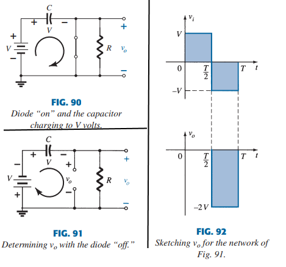
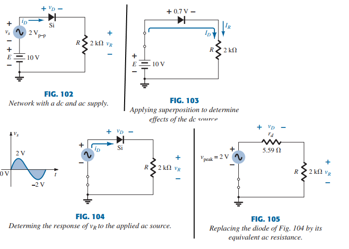
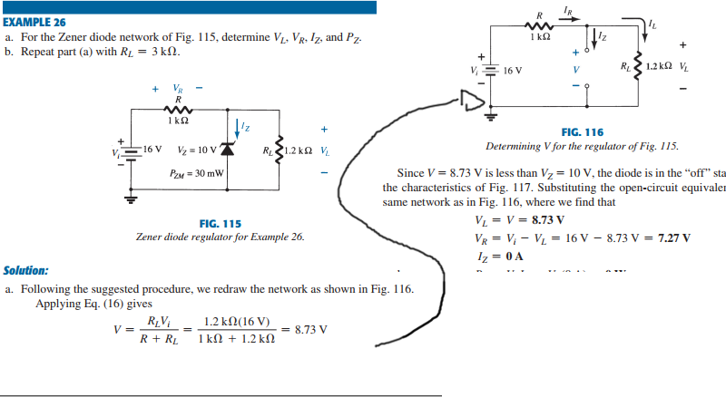

# Chapter 2, Diode applications

### Goals

- understand load line analysis and apply it
- use equivalent circuits to analyze series, parallel or combo diode networks.
- understand rectification
- predict output from clippers and clampers
- familiarize you with applications of zener diodes

# 2.1 Intro

**Once the basic behaviour of a device is understood, it's function and response in an inf. variety of configs can be
examined. The analysis of electronic circuits can follow 2 paths; using the actual characteristics or using an approximate
model for the device.**

Most of the time, we'll be using the simplified model, and when confident that the numbers make sense, the piecewise model,
and sometimes, with the actual characteristics. This is done to prevent needless number crunching.

# 2.2 Load-line analysis

Fig 1 shows a very simple diode network. We'll use it to describe the analysis of it using the actual characteristics. later
on, we'll replace it with an approx. model and then compare ansers. Solving the circuit in fig 1 is all about finding the I-V
characteristics of the diode and network at the same time.

In fig 2, the diode characteristics are placed in the same graph as a straight line defined by parameters of the network. The
straight line is the **load line** because the intersection on the y-axis is defined by load R. The intersection of the 2
curves will determine the solution for the network, and i-v levels. Before going to the details, we need to determine the
expected response of the circuit in fig 1. Note that the potential established by the power supply is in the clockwise direction.
Since its the same direction as the arrow of the diode, the diode is on. with current direction established, the polarities for
the $V_D, V_R$ can be superimposed. This results in a $V_D \approx 0.7 V, I_D \approx 10 mA$. The intersections of the loadline
can be determined bt applying kvl in clockwise, which results in $+E - V_D - V_R = 0$, or

$$
\begin{aligned}
    E = V_D + I_D \cdot R \tag{1}
\end{aligned}
$$

The intersections of the loadline on the characteristics can easily be determined if you remember thaat anywhere on the x-axis
$I_D = 0$, anywhere on y-axis $V_D = 0$ . If we _set_ $V_D = 0$ in eq 1 and solve for $I_D$, we know $I_D$ on the y-axis.

$$
\begin{aligned}
    I_D = {E \over R} \bigr\rvert_{V_D = 0V} \tag{2}
\end{aligned}
$$

Similarly, if we set $I_D = 0$ and solve for $V_D$, we get:

$$
\begin{aligned}
V_D = E \bigr\rvert_{I_D = 0A} \tag{3}
\end{aligned}
$$

A straight line drawn between these 2 points will give you the loadline. Changing the $R_load$, and the intersection will change.
The intersection point is the point of operation, or the quiescent point (_Q-point_). See example 1 page 60.

**As can be seen, the load line is determined by the network/system, and the characteristics are defined by the device.**

Here's an equivalent network:

We can do the exact same analysis with the simplified and the ideal model of a diode. The use of the ideal model is still different
enough that you'd much rather choose the simplified model.

# 2.3 Series diode config.

**The primary goal of this text is to develop a general knowledge of the behaviour, capabilities, and possible areas of application of
this device in a manner that will minimize the need for extensive mathematical developments. For all the analysis to follow in this
chapter, we assume that the forward resistance of the diode is usually insignificant when compared to other series resistances, so it
can be ignored**

We'll be using approximate models to analyze a number of series diode configs. In time, we'll simply include a $V_K = 0.7V$ drop across
each "on" diode, and draw a diagonal line through diodes in their "off" state. For now, we'll substitute to determine the proper I-V levels.
The series circuit in fig 8 will be used to demonstrate the approaches. The state of the diode is first determined by mentally replacing the
diode with a resistor. The resulting direction of I is a match to the arrow of the diode, and E > $V_K$, so the diode is on. Then, the network
is redrawn with the eq. model for the on diode in fig 9b.

The resulting I-V levels are the following:

$$
\begin{aligned}
V_D &= V_K \tag{4,5,6} \\
V_R &= E - V_K  \\
I_D &= I_R = {V_R \over R} \\
\end{aligned}
$$

In fig 10, we reversed the diode. We see that the diode will be 'off', because I does not match the arrow. Thus, we
replace the diode with an open circuit.

**An open cricuit can have any voltage across the terminals, but current is always 0 A. A short circuit has a 0-V drop across terminals, but
current is limited by the surrounding network**

From now on, this is the notation we'll be using, as it's pretty much industry standard

**_NOTE: DEFINITELY CHECK OUT THE EXAMPLES STARTING ON PAGE 65! _**

# 2.4 PARALLEL & SERIES-PARALLEL CONFIGS

The methods from 2.3 can also be applied to parallel and series-parallel configs. For each area of application, match the sequential steps.
**_NOTE: DEFINITELY CHECK OUT THE EXAMPLES STARTING ON PAGE 68! Definitely example 13. _**

# 2.5 AND/OR GATES

We can make AND/OR gates with diodes. Look at the example right besides the start of 2.5.

# 2.6 Sinusoidal Inputs: Half-wave rectification

The diode analysis can be expanded to include time-varying functions such as a square or sinus wave. The simplest network with a sinus wave
can be seen in fig 44. We'll be using ideal diodes for now to reduce complexity.  

Over 1 full period, the average value is 0. The circuit in fig 44 is called a half-wave rectifier, which has an average value of particular
use in the ac-do-dc process. We call diodes in a rectification process _rectifiers_, and it's power and current ratings are usually much higher.
During half the period, the diode will be on and the other half, it'll be off. Substituting the diode will result in fig 45, where we can see
that the output waveform is the exact same as the input. For the period [0.5 T - T], the diode is off, and fig 46 has the substitute circuit.
The result is that $v_o = i \cdot R = 0 V$ for the period [0.5 T , T]. Look at the input and output in fig 47. The output
now has a net positive area above the axis over a full period, and an average value of

$$
\begin{aligned}
V_{dc} = 0.318 V_m \tag{7}
\end{aligned}
$$

The process of removing half the input signal to get a dc level is called _half-wave rectification_. The effect of using a silicon diode with
$V_K = 0.7 V$
is as follows; The applied signal must be > 0.7 V, so $v_o = v_i - 0.7$. The net effect can be described as following:

$$
\begin{aligned}
V_{dc} = 0.318 (V_m - V_K) \tag{8}
\end{aligned}
$$

## PIV (PRV)

The peak inverse voltage or peak reverse voltage (PIV, PRV) of a diode is very important when designing rectification
system. Recall that if $- V_K \lt PIV$,
we enter the Zener avelanche region, where it starts conducting in the reverse direction.

It's very important that

$$
\begin{aligned}
PIV rating \geq V_m \tag{9}
\end{aligned}
$$

# 2.7 FULL-WAVE RECTIFICATION

## Bridge network

The dc level obtained from a sinus wave can be improved by 100% by using _full-wave rectification_. The most comonly used
circuit to do this is a _bridge_ and
can be seen in fig 53. The resulting polarities are shown in fig 54, and show that with ideal diodes, there will always
be 2 diodes conducting. The result is the config in fig 55. See output in the neg. region in fig 56, and the resulting output in fig 57.

Since the area above the axis is now twice as large, the dc level doubles.

$$
\begin{aligned}
V_{dc} = 0.636 (V_m) \tag{10}
\end{aligned}
$$

If we use silicon diodes instead of ideal ones, the result can be seen in fig 58, and we get a dc level of

$$
\begin{aligned}
V_{dc} = 0.636 (V_m - 2 V_K) \tag{11}
\end{aligned}
$$

## Center tapped transformer

A second popular full-wave rectifier can be seen in fig 60, with only 2 diodes. The downside is that you need a center
tapped transformer to establish the input signal across each section of the transformer. During the positive portion of
the $V_i$ applied to the primary coil, the network is like shown in fig 61 with a positive pulse across each section of
the secondary coil. $D_1$ will be short circuited, and $D_2$ will be open, as determined by secondary voltages and the resulting
current directions. During the negative portion, see fig 62. The diode state reverses.

**NOTE: PIV of this config is $PIV \geq 2 V_m$**

# 2.8 Clippers

We'll now show you the wave-shaping abilities of diodes with clippers and clampers. **Clippers are networks that employ
diodes to clip away a portion of the input signal without distorting the remaining part of the applied waveform**
The half-wave rectifier is the simplest form of a clipper, a resistor and a diode. Depending on the orientation, the
positive or negative region of the signal is clipped off. There are 2 general categories of clippers, series and parallel.
The series config is where the diode is in series with the load, and the parallel variety, you guessed it, the remains
in a parallel branch to the load.

## SERIES

The response of a series config is shown in fig 68. Although first introduced as a rectifier, there are no boundaries to
the type of signals that can be applied to a clipper.

The addition of a v-source to the network in fig 69 can have a significant effect on the analysis of the config. The
response is not as obvious, because the v-source can aid and work against the $V_i$, and the v-source can be in the leg
between the $V_i$ and output or in a branch parallel to the output. There's no general process for analysing networks such
as fig 69, but these steps can help:

1. Take note where the $V_o$ is defined
2. Try to develop an overall sense of the response by noting the 'pressure' established by each source and the effect it'll have on the current direction through the diode.
3. Get the applied $V_D$ that will result in a change of state for the diode.
4. It's often helpful to graph the $V_o$ directly below the $V_i$ using the same scales.
   In fig 69, the source works against $V_i$ when it's positive, and work with it when it's negative. The result is that the $V_{Omax}$ will be lowered by V.

# PARALLEL

The network of fig 81 is the simplest parallel diode config. See output response as done in fig 68 here as well.

When the diode is off, $v_o = v_i$, and when the diode is on, $v_o = v_D = 0$ (ideal diode)

**NOTE: SEE EXAMPLES ON PG 85 TO UNDERSTAND HOW TO ANALYZE THESE.**
Here are some basic clipper circuits.

## Summary

A variety of series and parallel clippers with the resulting output for sinus waves are provided in fig 88. Note the last one especially.

# 2.9 Clampers

**A clamper is a network constructed with a diode, resistor and capacitor that shifts a waveform to a different dc level
without changing the appearance of the applied signal.**
Additional shifts can be obtained by introducing a dc supply to the config. The chosen R and C of the network must be chosen
such that the time $\tau = R \cdot C$ is large enough that the $V_C$ doesn't discharge significanty during the time the
diode is off. Throughout the analysis, we'll asume that a cap fully (dis)charges in $5\tau$. The simplest clamper network
is shown in fig 89. Note how the cap is placed between the input and output, and the R and diode are in parallel to the output.

**Clamping networks have a cap. connected directly from input to output with a resistor in parallel with the output. The
diode is also parallel with the output, but may have a series dc supply added.**

These steps will make it easy to analyze the network:

1. Start by analysing the response of the portion of the input where the diode is on.
2. Durint the time that the diode is on, assume the cap will charge instantaniously to a voltage level determined by the network.
3. Assume that when the diode is off, the cap holds on to the established voltage level.
4. During the analysis, be aware of the location and polarity for $v_o$ to ensure proper levels are obtained.
5. Check that the total swing of the output matches the input.

**Example with fig 89.** The diode is on during the positive part of the signal. The short circuit eq. results in a $v_o = 0$
for this interval, as shown in fig 92. During this time, the $\tau$ is very small, because R has been shorted out, and the
only resistance is the inherent(wire, contact) resistance of the network. This means the cap will charge very quick to
it's peak voltage $V$ as shown in fig 90. When the input switches to negative, the network will be as shown in fig 91, with
the open circuit equivalent for the diode determined by the $v_i$ and stored V across the cap, both 'pressuring' current
through the diode from + to -. Now that R is back in the network, the $\tau$ is large enough to establish a discharge
period of $5\tau$ that's greater than 0.5 T, and it can be assumed on an approximate basis that the cap holds it's charge
and voltage during this period. Since $v_o$ is in parallel with diode and R, it can be drawn in an alternate position as
shown in fig 91. Applying KVL around the input loop gives us $-V - V - v_o = 0 \Leftrightarrow v_o = -2 V$.
The negative sign results from the fact that the polarity of 2V is opposite to the polarity of $v_o$. The resulting output
appears in fig 92 with the input. The output is clamped to 0V for [0, 0.5T] but mantains the same total swing (2V) as the input.

**NOTE: CHECK OUT THE EXAMPLE EXCERCISES STARTING ON PG. 88**

fig 100 shows a number of basic clamping circuits and their effect. Eventhough all the waveforms appearing here are square
waves, clamping networks work as well with sinusoids. In fact, **We often replace a sinusoidal wave by a square wave with
the same $V_p$ when analyzing networks. The resulting output will then form an enveloppe for the sinusoid**

# 2.10 netowkrs with a DC and AC source

So far, we only analyzed circuits with a single dc, ac or square wave input. Now we'll include both in the same config.
Fig 102 is the simplest 2-source network. We need to apply the superposition theorem here. that is, **The response of any
network with both an ac and a dc source can be found by finding the response to each source independently and then
combining the results**

## DC source

The network is redrawn in fig 103 for the dc source. Note that the ac source has been short circuited. Using the approx.
equivalent circuit for that diode, the $v_o$ is:
$V_R = E - V_D = 10 V - 0.7 V = 9.3 V \\
I_D = I_R = {0.3 V \over 2 k\Omega} = 4.65 mA$

## AC source

The dc source will be short circuited, as shown in fig 104. The diode will be replaced by the ac resistance, $r_d$.
For this case, $r_d = {26 mV \over I_D} - {26 mV \over 4.65 mA} = 5.59 \Omega$

Replacing the diode by this resistance will result in fig 105. For the $V_{Rpeak}, V_{Dpeak}$,

$V_{Rpeak} = {2 k\Omega \cdot 2 V \over 2 k \Omega + 5.59 \Omega} \approx 1.99 V \\
V_{Dpeak} = V_{Speak} - V_{Rpeak} = 2 V - 1.99 V = 0.01 V = 10 mV$
Combining the results of Dc and AC anal will result in fig 106 for $V_R, V_D$.

Note that the diode has an important impact on the output voltage $V_R$, but little impact on ac swing. For comparison, the same
system will now be analyzed using the actual characteristics and load line analysis.
Fig 107 has that. The resulting dc current is now slightly less due to V drop across the diode that's slightly more than 0.7.
For the peak Value of the input voltage the loadline will have intersections of $E = 12 V, I = {e \over R} = {12 V \over 2 k \Omega} = 6mA$

For the negative peak, the intersections are at 8V and 4 mA. Note the region of diode characteristics traversed by the AC swing.
It defines the region for which the $R_{d}$ was determined. In this case, dc current is approx. 4.6 mA, so the new
$R_{d} = {26 mV \over 4.6 mA} = 5.65 \Omega$, which is very close.

Anyway, it is clear that the change in $V_D$ is very small, resulting in a small impact on $V_o$. In general, the diode
has a strong impact on the DC level of the output voltage, but very little impact on the ac swing of the output. The diode was
clearly close to the ideal for ac voltage and 0.7 V off for the dc level. This is due tot he almost vertical rise of the diode
after $V_K$. In most cases, "on" diodes in series with loads will have some effect on the DC level but very little on the
ac swing if the diode is fully conducting for the full cycle. For the future, when dealing with diodes and an ac signal, the dc leve3l through
the diode is first determined and the ac resistance level determined by $V_T = {kT_K \over q}$. This ac resistance can be
substituted in place of the diode.

# 2.11 Zener diodes

The analysis of networks using Zener diodes is quite similar to the analysis in the previou sections. First, we determine
the state of diode, then substitute and determine the unknown vars. Fig 108 shows the substitutes
for the different states.

**DEFINITELY check out example 25,pg 94.**

The use of a Zener diode as regulator is so common that the 3 conditions surrounding the analysis of the Zener diode are
considered. The simpllest config can be seen in fig 112. We'll use fixed quantities, followed by fixed supply V and load,
and fixed load and variable V.

## $V_i$ and R fixed

The steps are:

1. Determine the state of the diode by removing it from the network and calculating the V across the resulting open circuit
2. Substitute the appropriate equivalent circuit and solve for wanted unknowns

Applying step 1 to the network in fig 112 results in fig 113.

$$
\begin{aligned}
V = V_l = {RL \cdot V_i \over R + R_L} \tag{16}
\end{aligned}
$$

if $V \geq V_Z$, the Zener diode is on, otherwise it's off.

For the network in fig 112. the on state will result in fig 114. Since voltages across parallel elements must be the same,

$$
\begin{aligned}
V_L = V_Z \tag{17}
\end{aligned}
$$

The zener diode current must be determined with KCL. that is,

$$
\begin{aligned}
I_R = I_Z + I_L \\
I_Z = I_R - I_L \tag{18}
\end{aligned}
$$

where $I_L  = {V_L \over R_L}, I_R = {V_R \over R} = {V_i - V_L \over R}$

## Fixed $V_i$, variable $R_L$

Due to $V_Z$, there's a specific range of resistor values that will ensure that the Zener is on. If $R_L$ is too small, $V_L \lt V_Z$,
so the diode will be off. To determine the load resistance that will turn on the diode, calculate $R_L$ that will result in $V+L = V_Z$.
That is,

$$
\begin{aligned}
R_{Lmin} = {R \cdot V_Z \over V_i - V_Z} \tag{20}
\end{aligned}
$$

Any load greater than the obtained value will turn the zener diode on. The condition of eq 20 defines the max $I_L$ as

$$
\begin{aligned}
I_{Lmax} = {V_L \over R_L} = {V_Z \over R_{Lmin}} \tag{21}
\end{aligned}
$$

Once the diode is on, these remain fixed :

$$
\begin{aligned}
V_R = V_i - V_Z \tag{22, 23} \\
I_R = {V_R \over R}
\end{aligned}
$$

and the Zener current $I_Z = I_R - I_L$, resulting in a minimum $I_Z$ where $I_L$ is a max, and a max $I_Z$ when $I_L$ is a min, since $I_R$ is constant.

# NOTE: NOT DONE, BUT NEED TO FOCUS ON OTHER TOPICS TOO. STOPPED AT PG 99

# NOTE: NOT DONE, BUT NEED TO FOCUS ON OTHER TOPICS TOO. STOPPED AT PG 99

# NOTE: NOT DONE, BUT NEED TO FOCUS ON OTHER TOPICS TOO. STOPPED AT PG 99

# NOTE: NOT DONE, BUT NEED TO FOCUS ON OTHER TOPICS TOO. STOPPED AT PG 99

# Summary

1. The characteristics of a diode are unaltered by the network in which it is employed. The network simply determines the point of operation of the device.
2. The operating point of a network is determined by the intersection of the network equation and an equation defining the characteristics of the device.
3. For most applications, the characteristics of a diode can be defined simply by the threshold voltage in the forward-bias region and an open circuit for applied voltages less than the threshold value.
4. To determine the state of a diode, simply think of it initially as a resistor, and find the polarity of the voltage across it and the direction of conventional current through it. If the voltage across it has a forward-bias polarity and the current has a direction that matches the arrow in the symbol, the diode is conducting.
5. To determine the state of diodes used in a logic gate, first make an educated guess about the state of the diodes, and then test your assumptions. If your estimate is incorrect, refine your guess and try again until the analysis verifies the conclusions.
6. Rectification is a process whereby an applied waveform of zero average value is changed to one that has a dc level. For applied signals of more than a few volts, the ideal diode approximations can normally be applied.
7. It is very important that the PIV rating of a diode be checked when choosing a diode for a particular application. Simply determine the maximum voltage across the diode under reverse-bias conditions, and compare it to the nameplate rating. For the typical half-wave and full-wave bridge rectifiers, it is the peak value of the applied signal. For the CT transformer full-wave rectifier, it is twice the peak value (which can get quite high).
8. Clippers are networks that “clip” away part of the applied signal either to create a specific type of signal or to limit the voltage that can be applied to a network.
9. Clampers are networks that “clamp” the input signal to a different dc level. In any event, the peak-to-peak swing of the applied signal will remain the same.
10. Zener diodes are diodes that make effective use of the Zener breakdown potential of an ordinary p–n junction characteristic to provide a device of wide importance and application. For Zener conduction, the direction of conventional flow is opposite to the arrow in the symbol. The polarity under conduction is also opposite to that of he conventional diode.
11. To determine the state of a Zener diode in a dc network, simply remove the Zener from the network, and determine the open-circuit voltage between the two points where the Zener diode was originally connected. If it is more than the Zener potential and has the correct polarity, the Zener diode is in the “on” state.
12. A half-wave or full-wave voltage doubler employs two capacitors; a tripler, three capacitors; and a quadrupler, four capacitors. In fact, for each, the number of diodes equals the number of capacitors.
