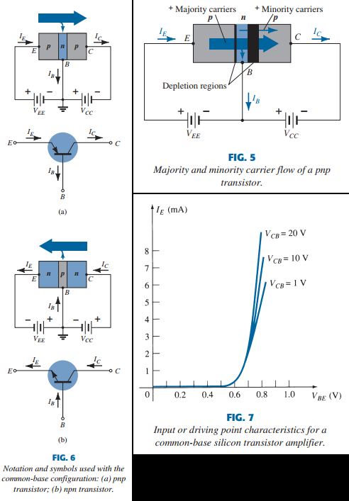

# Chapter 3, Bipolar Junction Transistors (BJTs)

# 3.2 Transistor construction

A transistor is a 3-layer semiconductor device containing either 2 n- and 1 p-type layers, or 2 p- and 1 n-type material.
The former is called an npn transistor, and the latter a pnp transistor. Both are shown in fig 3 with proper dc biasing.
The dc biasing is necessary to establish a proper region of operation for ac amplification. The emitter layer is heavily
doped, and the base and collector only lightly doped. The outer layers have widths much greater than the sandwiched p- or
n-type material. The sandwiched layer is also less doped than outer layers (typically 1:10 or less). The lower doping levels
decrease conductivity by limiting the free carriers. For the biasing in fig 3 the terminals have been indicated with E for
emitter, C for collector and B for base. The term _bipolar_ in BJTs reflects the fact that holes and electrons participate
in the injection process in the oppositely polarized material. If only 1 carrier is used, it's considered a _unipolar_ device,
such as the Schottky diode.

# 3.3 Transistor operation

The basic operation of a pnp transistor of fig 3a will be described. The working of an npn transistor is exactly the same
if the roles of electrons and holes are reversed. Fig 4a has a redrawn pnp transistor without the base-to-collector bias.
The depletion region has reduced in width due to the applied bias, resulting in a heavy flow of majority carriers from p-
to n- type material. We now remove the base-to-emitter bias as shown in 4b. Notice how similar this is to that of a
reverse-biased diode. Recall that the flow of majority carriers is 0, resulting in only a minority carrier flow, as shown
in fig 4b. In summary, **One p-n junction of a transistor is reverse-biased, while the other is forward-biased**

In fig 5 both biasing potentials have been applied to a pnp transistor, with the resulting carrier flows indicated. See
the width of the depletion region, indicating clearly which junction is forward- or reverse-biased. as shown in fig 5, a
large number of majority carriers will diffuse across the forward-biased p-n junction into the n-type material. Since the
sandwiched n-type material is very thin and a low conductivity, a small number of these carriers will take the path of high
resistance to the base terminal. The magnitude of $I_B$ is on the order of a few $\mu A$, compared to the mA for the $I_E, I_C$.
The larger numbers of these majority carriers will diffuse across the reverse-biased junction to the p-type connected to
the collector terminal, as shown in fig 5. The reason for the east with which the majority carriers can cross the reverse-biased
junction is easily explained if we remember that for the reverse-biased diode, the injected majority carriers will appear as minority
carriers in the n-type material. In other words, there has been an injection of minority carriers in the n-type region material.
Combining this with the fact that all the minority carriers in the depletion region will cross the reverse-biased junction of a  
diode accounts for the flow as shown in fig 5.

Applying KCL to the transistor in fig 5 as if it is a single node, we get

$$
\begin{aligned}
    I_E = I_C + I_B \tag{1}
\end{aligned}
$$

The $I_C$, however, comprises of 2 components, the majority and minority carriers as shown in fig 5. The minority current component
is called the _leakage current_, $I_{CO}( I_C$ current with emitter terminal Open). The $I_C$ is determined by

$$
\begin{aligned}
   I_C = I_{Cmajority} + I_{COminority} \tag{2}
\end{aligned}
$$

For general purpose transistors, $I_C$ is measured in mA, and $I_{CO}$ in $\mu A, nA. I_{CO}$, like $I_s$ for a reverse-biased diode,
is temperature sensitive and must be examined when applications of wide temp. ranges are considered, since it can severely affect the
stability of a system at high temps. Improvements have resulted in significantly lower $I_{CO}$ where the effects can be ignored

# 3.4 Common-base config

The notation used with the majority of texts is indicated in fig 6 for the common-base config for pnp and npn. The common-base terminology
is derived from the fact that the base is common to both the input and output sides of the config. Also, the base is usually the terminal
at or closest to the ground potential. this text will refer conventional (hole) flow when indicating current directions. The result is that
the arrows in all electronic symbols have a direction defined by this convention.

**The arrow in the graphic symbol defines the direction of emitter current (conventional flow) through the device**

Note that in each case, eq 1 is satisfied. Note also that the applied V sources are such as to establish current in the direction indicated.
That is, compare the direction of $I_E, V_{EE}$ and the direction of $I_C, V_{CC}$. To fully describe the behavior of a 3-terminal device
such as the common-base amplifiers of fig 6 requires 2 sets of characteristics, one for the _driving point or input parameters_ and the other
for the _output_ side. The input set for the common-base amp as shown in fig 7 relates an input current $I_E$ to an input voltage $V_{BE}$ for
various levels of output voltage $V_{CB}$

The output relates an output current $I_C$ to an output voltage $V_{CB}$ for different levels of input current $I_E$ as shown in fig 8. The
output or _collector_ set of characteristics has 3 basic regions of interest, the _active, cutoff and saturation regions._ The active region
is normally employed for linear (undistorted) amplifiers. In particular, **In the active region, B-E junction is forward biased, while C-B
junction is reverse-biased**

The active region is defined by biasing arrangements of fig 6. At the lower end of the active region, $I_E = 0$, and the collector current is
simply the reverse saturation current $I_{CO}$, as indicated in fig 9. The current $I_{CO}$ is so small that it appears on virtually the same
horizontal line as $I_C = 0$. The circuit conditions that exist when $I_E = 0$ for the common-base config are shown in fig 9. The notation
commonly used for $I_{CO}$ on data- or spec sheets is $I_{CBO}$ (collector-to-base with emitter Open). Usually, this is so low that the effect
can be ignored. However, for high power units, $I_{CBO}$ will still be in the $\mu A$ range, and is still temp. sensitive, so it may become an
important factor at high temps, since it increases rapidly. Note in fig 8 that as $I_E$ increases above zero, the $I_C$ increases to a magnitude
about equal to that of $I_E$ as determined by the basic transistor-current relations. See also the almost negligible effect of $V_{CB}$ on the
collector current for the active region. The curves indicate that _a first approximation for the relation between $I_E, I_C$ in the active region is_

$$
\begin{aligned}
   I_C \approx I_E \tag{3}
\end{aligned}
$$

As inferred by the name, the cutoff region is defined as that region where the collector current is 0A, as shown in fig 8. In addition, **In the cutoff
region the base-emitter and collector-base junctions are both reverse-biased**

The saturation region is defined as the region of characteristics to the left of $V_{CB} = 0 V$. The horizontal scale in this region is expanded
to clearly show the dramatic change in characteristics in this region. See the exponential increase in $I_C$ as $V_{CB}$ increases towards 0V.

**In the saturation region, base-emitter and collector-base junctions are forward biased**

The input characteristics of fig 7 reveal that for fixed values of collector Voltage $V_{CB}$, as the base-to-emitter voltage increases, $I_E$
increases in a manner that resembles a that of a diode. In fact, increasing $V_{CB}$ has such a small effect on characteristics drawn as shown
in fig 10a. If we apply the piecewise-linear approach, the characteristics of fig 10b result. Taking it a step further and ignoring the slope
of the curve, and therefore the resistance associated with the forward-biased junction, results in characteristics in fig 10c. For the analysis
to follow, the equivalent model of fig 10c will be used for all the dc analysis of transistor networks. That is, once a transistor is on,

$$
\begin{aligned}
   V_{BE} \approx 0.7 V \tag{4}
\end{aligned}
$$

In other words, the effect of variations due to $V_{CB}$ and the slope of input characteristics will be ignored, as we want to analyze transistor
networks such that they provide a good approximation to the actual response without too much calculations.

It's important to fully appreciate the statement made by fig 10c. They say that with the transistor being "on" (being in the active stage), the $V_{BE}$
will be at 0.7 V for any level of $I_E$ as controlled by the network. In fact, when encountering any transistor config in dc mode, one can immediately
specify that $V_{BE} = 0.7 V$, if the device is in the active region.

## Alpha ($\alpha$)

**DC MODE**
In dc mode the levels of $I_C, I_E$ due to majority carriers related by a quantity called alpha is defined by the following:

$$
\begin{aligned}
    \alpha_{dc} = {I_C \over I_E} \tag{5}
\end{aligned}
$$

Where $I_C, I_E$ are the current levels at point of operation. Eventho the characteristics of fig 8 would suggest that $\alpha = 1$, for practical devices
it's typically between 0.9 and 0.998, with most values being at the higher end of the range. Since alpha is defined only by the majority carriers, eq 2 becomes

$$
\begin{aligned}
	I_C = \alpha I_E + I_{CBO}\tag{6}
\end{aligned}
$$

For the characteristics of fig 8 when $I_E = 0 mA$, $I_C = I_{CBO}$, but it's usually so small it's virtually undetectable on the graph. In other words, when
$I_E = 0 mA, I_C \approx 0 mA$

## **AC MODE**

For ac situations where the point of operation moves on a curve, alpha ac is defined by

$$
\begin{aligned}
   \alpha_{ac} = {\Delta I_C \over \Delta I_E} \Biggr\rvert_{V_{CB} = constant}  \tag{7}
\end{aligned}
$$

The ac alpha is formally called the _common-base, short-circuit, amplification factor_. Most of the time, $\alpha{ac} \approx \alpha{dc}$, allowing one to
substitute one for the other. The use of EQ 7 will be shown in section 6.

## Biasing

The proper biasing of the common-base config in the active region can be determined quickly by $I_C \approx I_E$ and assuming $I_B \approx 0 \mu A$. The
result is the config of fig 11 for the pnp transistor. The arrow defines the direction of current, the dc supplies are placed with the polarity that'll
support that. for npn the directions are reversed.
A quick mnemonic is NPN (Not Pointing iN), PNP(Pointing iN)

## Breakdown Region

As $V_{CB}$ goes up, there's a point where the curve goes up dramatically in FIG 8. This is due to an avalanche effect where reverse-bias V reaches the
breakdown region. As stated earlier, the B\*C junction is reverse-biased in the active region, but there's a point where the voltage will reach the
avalanche effect. This results in a large increase in current for a small increase in $V_{BC}$. The largest base-to-collector voltage is labeled
$BV_{CBO}$ as shown in FIG 8, sometimes referred to as $V_{(BR)CBO}$ as shown in FIG 23. note in each of the notations, the O refers to the E being open.
Very important to remember that this is only for the common-base config. In the common-emitter config the limiting V is quite less.

# 3.5 Common-emitter config

The most frequently found transistor config can be seen in FIG 12, for pnp and npn. It's called the _common-emitter config_ because the emitter is common
to both the input and output terminals(B and C terminals here). 2 sets of characteristics are again needed to describe the behavior of the common-emitter
fully: One for the input or base-emitter circuit, and one for the output or collector-emitter circuit, both shown in fig 13.

Eventho the transistor config has changed, the same current relations apply ($I_E = I_C + I_B, I_C = \alpha I_E$). For the common-E config the output
characteristics are a plot of the output current $I_C$ versus the output V $V_{CE}$ for a range of values of input current $I_B$. The input characteristics
Are a plot of the input current $I_B$ versus the input V $V_{BE}$ for a range of output V $V_{CE}$.
Note that on the characteristics of FIG 14 the magnitude of $I_B \approx \mu A, I_C \approx mA$. Consider that the curves of $I_B$ aren't as horizontal as
those obtained for $I_E$ in the common-B config, indicating that hte $V_{CE}$ will be influenced by the magnitude of the $I_C$. The active region for the
common-E config is that portion of the upper-right region that has the greatest linearity(where $I_B$ is nearly straight). In FIG 14a this region is to the
right of the vertical dashed line at $V_{CEsat}$ and above $I_B \approx 0$. The region to the left of $V_{CEsat}$ is the saturation region.

**In the active region of the common-e amplifier, the BE junction is forward-biased, while the CB junction is reverse-biased**
You'll recall that these were the same conditions in the active region of common-B config. The active region fo the common-E config can be employed for
V, I or P amplification. The cutoff region for common-E config is not as well defined as that of the common-B config. Note on the c characteristics of
FIG 14 that $I_C \neq 0 \forall I_B = 0$. For the common-B config, when the input current $I_E = 0$, $I_C I_{CO}$, so that the curve $I_E = 0$ and the
voltage axis were practically one. The reason for this difference in C characteristics can be derived through manipulation of EQ 3 and 6. that is:

$$
\begin{aligned}
I_C &= \alpha I_E + I_{CBO}\\
I_C &= \alpha (I_C + I_B) + I_{CBO} \\
I_C &= {\alpha I_B \over 1 - \alpha } + {I_{CBO} \over 1 - \alpha} \tag{8}
\end{aligned}
$$

If we consider the case discussed above, where $I_B = 0 A$ and substitute $\alpha = 0.996$, the result is

$$
\begin{aligned}
I_C &= {\alpha (0 A) \over 0.004} + {I_{CBO} \over 0.004} \\
&= {I_{CBO} \over 0.004} = 250 I_{CBO}
\end{aligned}
$$

If $I_{CBO} = 1 \mu A$, the resulting $I_C\ with\ I_B = 0A$ would be 0.25 mA, as shown in fig 14. For future reference, the $I_C$ is defined by the
condition $I_B = 0 \mu A$ will be indicated by the following equation:

$$
\begin{aligned}
I_{CEO} = {I_{CBO} \over 1- \alpha }  \Biggr\rvert_{I_B = o \mu A} \tag{9}
\end{aligned}
$$

In Fig 13, the conditions surrounding this newly defined current are demonstrated with it's assigned reference direction.
**For Linear amplifier purposes, the cutoff for the common-E config will be defined by $I_C = I_{CEO}$**

In other words, the region below $I_B = 0 \mu A$ is to be avoided when undistorted output is required. When used as a switch in the logic circuitry of a
computer, a transistor has 2 points of operation of interest: one in the cutoff and one in the saturation region.

The cutoff condition should ideally be $I_C = 0 mA$ for the chosen $V_{CE}$. Since $I_{CEO}$ is typically low for silicon, cutoff will exist for switching
purposes when $I_B = 0 \mu A or I_C = I_{CEO}$ for silicon transistors only. For Ge transistors, cutoff for switching purposes will be defined as those
conditions where $I_C = I_{CBO}$. This condition can normally be obtained for Ge transistors by reverse-biasing the BE junction to 0.1 V. Recall that for the
common-B config that the input set of characteristics was approximated by a straight line that resulted in $V_{BE} = 0.7 V$ for any level of $I_E \gt 0 mA$.
For the common-E config the same approach applies, resulting in fig 15. The result supports our earlier conclusion that for a transistor in the on or active region
the $V_{BE} = 0.7 V$, for any level of $I_B$

## Beta ($\beta$)

**DC MODE**
In DC mode the levels of $I_C, I_B$ are related by a quantity called beta and defined as follows:

$$
\begin{aligned}
\beta_{dc} = { I_C \over I_B } \tag{10}
\end{aligned}
$$

where $I_C, I_B$ are determined at a particular operating point. Practically, $\beta \in [50, 400]$, with most in the midrange. as for $\alpha, \beta$ reveals the relative
magnitude of one current with respect to another. For a device with a $\beta = 200$, the $I_C = 200 I_B$. On spec sheets, $B_{dc}$ is usually indicated as $h_{FE}$
(**h**ybrid equivalent circuit, **f**orward-current amplification and common-**E** config)

**AC MODE**
For ac situations, ac beta is defined as

$$
\begin{aligned}
\beta_{ac} = { \Delta I_C \over \Delta I_B } \Biggr\rvert_{V_{CE} = constant} \tag{10}
\end{aligned}
$$

The formal name for it is _common-E, forward-current, amplification factor_. Since the $I_C$ is usually the output current for common-E configs, and $I_B$ is the input
current, the term amplification is included in the nomenclature. EQ 11 is similar to that of $\alpha_{ac}$ in section 4. The procedure for obtaining the alpha from characteristic
curves was not described because of the difficulty of actually measuring changes in $I_C, I_E$. EQ 11 can be described with clarity, and can be used to find the alpha using an
equation. On spec sheets, $B_{ac} = h_{fe}$ usually. The use of EQ 11 is est describes with a numerical example, such as characteristic in fig 13a and 17. Determining $B_{ac}$ for a
region of characteristics defined by operating point of $I_B = 25 \mu A, V_{CE} = 7.5 V$ as in fig 16. The restriction of $V_{CE} =$ constant requires a vertical line drawn through 
the operating point $V_{CE} = 7.5 V$. The $\Delta I_B$ as shown in EQ 11 is then defined by choosing 2 points on either side of the Q-point along the vert. axis about equal distance
 to either side. for this situation, $I_B = 20 \mu A, 30 \mu A$ is decent.

They also define levels of $I_B$ that are easily defined rather than requiring interpolation of the level between curves.
Keep the $\delta I_B$ as small as possible. At the 2 intersections and the vertical axis, the 2 levels of $I_C$ can be
determined by drawing a horizontal line over to the vert. axis and reading the resulting $I_C$ vals. The resulting beta
can then be determined by

$$
\begin{aligned}
\beta_{ac} &=  { \Delta I_C \over \Delta I_B } \Biggr\rvert_{V_{CE} = constant} \\
&= {3.2 mA - 2.2 mA \over 30 \mu A - 20 \mu A} = {1mA \over 10 \mu A} \\
&= 100
\end{aligned}
$$

The solution above reveals that for an ac input at B, the $I_C \approx 100 I_B$. When using the dc beta at Q-point, we get
$\beta_{dc} = {I_C \over I_B} = 108$, which is close enough to be used interchangeably most of the time. Generally, the
smaller the $I_{CEO}$, the more valid the approximation is. If the characteristics are approximated by those in fig 17,
the level of $\beta_{ac}$ would be the same in every region. Note that each $\Delta I_B = 10 \mu A, \Delta I_C = 2 mA$,
so $\beta_{ac} = 200$, and $\beta_{dc} = 200$ when calculated as well.

Although a true set of transistor characteristics
will never look exactly like FIG 17, it does provide a set of characteristics for comparison with those from a tracer.
For the following analysis, we will use $\beta$ w/o subscript. A relationship can be developed between $\beta, \alpha$
using basic relationships introduced so far. Using

$$
\begin{aligned}
\beta = {I_C \over I_B} &\leftrightarrow I_B = {I_C \over \beta} \\
\alpha = {I_C \over I_E} &\leftrightarrow I_E = {I_C \over \alpha}

\end{aligned}
$$

Substituting into

$$
\begin{aligned}
I_E &= I_C + I_B \\
{I_C \over \alpha} &= I_C + {I_C \over \beta} \\
&\text{dividing both sides by} I_C \\
{1 \over \alpha} &= 1 + {1 \over \beta}

\end{aligned}
$$

In the end,

$$
\begin{aligned}
   \alpha = {\beta \over \beta + 1} or \tag{12,13} \\
\beta = {\alpha \over 1 - \alpha}
\end{aligned}
$$

In addition, recall that $I_{CEO} = {I_{CBO} \over 1 - \alpha } \equiv  {1 \over 1 - \alpha} = \beta + 1$
derived from above, we find that $I_{CEO} = (\beta + 1) I_{CBO}$ or

$$
\begin{aligned}
I_{CEO} \approx \beta I_{CBO} \tag{14}
\end{aligned}
$$

Beta is particularly important because it provides a link between current levels of input and output circuits for a
common-E config. That is,

$$
\begin{aligned}
I_C = \beta I_V \tag{15}
\end{aligned}
$$

and with some manipulation, we get

$$
\begin{aligned}
I_E = (\beta + 1) I_B \tag{16}
\end{aligned}
$$

## Biasing

The proper biasing of a common-E amplifier can be determined the same way as that of common-B. Let's assume we are
presented with an npn transistor as shown in FIG 18a and asked to apply th proper biasing to place the device in
the active region. The first step is to indicate the direction of $I_E$ as established by the arrow in the symbol.
Next, the other currents are introduced keeping in mind KCL and $I_C + I_B = I_E$. Finally, the voltages are introduced
with polarities that'll support those current directions. The same for pnp transistors, just everything reversed.

# Breakdown region

As with common-B, there's a max $V_{CE}$ that can be applied and still remain in the stable region of operation. Fig 19
has extended characteristics from fig 8 to demonstrate the impact on characteristics at high $V_{CE}$. At high levels of
$I_B$ the current almost climbs vertically, whereas at lower levels a region that has a weird curve due to the **negative!**
resistance, where an increase in current means a decrease in voltage. It may seem weird af, but there are devices that rely
on this property/characteristic. The recommended max value for a transistor under normal operating conditions is labeled $BV_{CEO}$
or $V_{(BR)CEO}$. It's less (often 0.5 x) $BV_{CBO}$. For this breakdown region, there are 2 reasons for the change in curvature.
One is the **avalanche breakdown** mentioned for common-B, and **punch-through, caused by Early Effect** The avalanche effect is
dominant because any $\Delta I_B = \beta \cdot I_C$, which will contribute to the ionization process during breakdown, which causes
a higher $\Delta I_B$ and so on.

# 3.6 Common-C config

The last transistor config is the common-E config, as shown in fig 20 with proper current directions and biasing. The common-E is used
primarily for impedance-matching purposes since it has high input impedance and low output impedance, opposite of common-B and common-E.

A common-C circuit is shown in fig 21 with a load resistor connected from E to ground. Note that the C is tied to ground eventho the
transistor is connected in a manner similar to common-E. From a design perspective, we don't need a set of common-C to choose the parameters
of circuit 21. It can be designed using the common-E characteristics. For all practical purposes, the output characteristics
of common-C are the same as common-E. For the common-C the output characteristics are a plot of $I_E, V_{CE}$ for a range
of $I_B$. The input current is the same for both common-E and common-C characteristics. The horizontal V axis for common-C is
obtained by changing the sign of $V_{CE}$ to common-E characteristics. Finally, there's a very small change in the vertical
scale of $I_C$ of the common-E characteristics if $I_C$ is replaced by $I_E$ for the common-E since $\alpha \approx 1$. For
the input circuit of common-C the common-E base characteristics are enough to obtain the required info.

# 3.7 Limits of operation

For each transistor, there's a region of operation on the characteristics that will ensure that the max ratings are not exceeded
and the output signal is not very distorted. This region is defined for characteristics of fig 22. All of the limits of operation
are defined on a spec sheet. Some of the limits are self explanatory, such as $P_{Cmax}$ (normally referred to as _continuous collector
current_) and $BV_{CEO}, V_{(BR)CEO}$ (max collector-emitter voltage). For the transistor in FIG 22, $I_{Cmax} = 50 mA, BV_{CEO} = 20V$.
The vertical line on the characteristics defined as $V_{CEsat}$ specifies the minimum $V_{CE}$ needed without falling in the nonlinear
saturation region. The level of $V_{CEsat}$ is usually around 0.3 V. The max dissipation level is

$$
\begin{aligned}
P_{Cmax} - V_{CE} \cdot I_C \tag{17}
\end{aligned}
$$

For the one in fig 22, $P_{Cmax} = 300 mW$.
To get a rough estimate of the curve, we use the $V_{CE}$ at $I_{Cmax}$, at $V_{CEO}$ and at 0.5 $I_{Cmax}$ if the characteristic curve
isn't on the spec sheet. One must simply be sure that $I_C, V_{CE}, P_{Cmax}$ fall in the following range:

$$
\begin{aligned}
I_{CEO} \leq I_C &\leq I_{Cmax} \\
V_{CEsat} \leq V_{CE} &\leq V_{CEmax} \tag{18} \\
V_{CE}I_C &\leq P_{Cmax}
\end{aligned}
$$

For common-B characteristics the max power curve is defined by

$$
\begin{aligned}
P_{Cmax} = V_{CB}I_C \tag{19}
\end{aligned}
$$

# READ 3.8. 3.9, 3.10 yourself, not the most important section, but vaguely interesting

# READ 3.8. 3.9, 3.10 yourself, not the most important section, but vaguely interesting

# READ 3.8. 3.9, 3.10 yourself, not the most important section, but vaguely interesting

# READ 3.8. 3.9, 3.10 yourself, not the most important section, but vaguely interesting

# READ 3.8. 3.9, 3.10 yourself, not the most important section, but vaguely interesting

# 3.12 Summary, finally

## Important concepts

1. Semiconductors are better than vacuum tubes for the following reasons:
   - smaller
   - more lightweight
   - more rugged
   - more efficient
   - no warmup period
   - no heater requirement
   - lower operating voltages
2. Transistors are 3-terminal devices of 3 semiconductor layers having a base sandwich layer that's thinner than the other 2. The outer 2 are either n or p type, opposite of the sandwiched type.
3. one p-n junction is forward biased, while the other is reverse-biased
4. The dc $I_E$ is always the largest current, whereas $I_B$ is the smallest. Also, $I_E = I_B + I_C$
5. The dc $I_C =$ Majority current + minority(leakage) current
6. The arrow in the transistor symbol defines the conventional current flow for $I_E$ and thus defines the other current directions
7. A 3-terminal device needs 2 sets of characteristics to completely define it's characteristics
8. In the active region of a transistor, BE junction is forward-biased, while CB junction is reverse-biased
9. In the cutoff region, BE and CB junctions are reverse-biased
10. In the saturation region, BE and CB are forward-biased
11. On average, a good first approximation of $V_{BE} = 0.7$
12. The quantity $\alpha$ relates the $I_E, I_C$ and is always close to 1
13. The impedance between terminals of a forward-biased junction is always pretty small, whereas the terminals of a reverse-biased junction is very large
14. The arrow in the symbol of a npn points out of the device (Not Pointing iN) and points out for pnp (Pointing iN)
15. For linear amplification purposes, cutoff for Common-E will be defined by $I_C = I_{CEO}$
16. The quantity $\beta$ provides the relationship between $I_B, I_C$ and lies between 50 and 400
17. The $\beta_{dc} = I_C \over I_B$ at operating point, while $\beta_{ac}$ needs a delta and is sensitive to rapid changes in curvature. They're usually close enough to substitute for each other.
18. To ensure that a transistor is operating within $P_{max}$, find $V_{}CE \cdot I_C$ and compare to rated value

## Equations

$$
\begin{aligned}
I_E &= I_C + I_B \\
I_C &= I_{Cmajority} + I_{Cminority} \\
V_{BE} &\approx 0.7 V \\
\\
\alpha_{dc} &= {I_C \over I_E} \\
\alpha_{ac} &= {\Delta I_C \over \Delta I_E} \Biggr\rvert_{V_{CB} = constant} \\
I_{CEO} &= {I_{CBO} \over 1 - \alpha } \Biggr\rvert_{I_B = 0 \mu A} \\
\\
\beta_{dc} &= {I_C \over I_B} \\
\beta_{ac} &= { \Delta I_C \over \Delta I_B} \Biggr\rvert_{V_{CE} = constant} \\
\alpha &= {\beta \over \beta + 1} \\
\\
I_C &= \beta I_B \\
I_E &= (\beta + 1) I_B \\
P_{Cmax} &= V_{CE} \cdot I_C
\end{aligned}
$$
