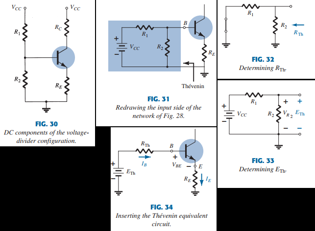

# Ch4, DC biasing of BJTs

# 4.1 Intro

A BJT doesn't magically raise the ac input magically without an external energy source.
In Actuality, **Any increase in ac V, I or P is the result of a transfer of energy from the applied DC supply**
The analysis or design of an amp has 2 components, an ac and a dc portion.
Fortunately, we can use the superposition theorem. One must also keep in mind that
during the design stage, the choices of parameters for the required dc levels will
change ac response and the reverse. The dc level of operation of a transistor is
controlled by a number of factors, including the range of possible operating points on the bjt. In section 2 we'll specify the range for
BJT amp. Once the wanted dc current and voltage levels are defined, a network must be constructed that'll create those operating points. We'll analyze a number of these networks.
Each design will also affect the stability of the network, meaning how sensitive it is to temp changes, etc.
The underlying similarity in the analysis of each config is due the following basic relationships for a transistor:

$$
\begin{aligned}
    V_{BE} \approx 0.7 V \tag{1,2,3} \\
    I_E = (\beta + 1) \cdot I_B \approx I_C \\
    I_C = \beta I_B
\end{aligned}
$$

Once we understand the analysis of the first few networks, we'll gain an intuition on how to solve the others.
Most of the time, $I_B$ is the first var to determine. Once it's known, the relationships in EQ 1,2,3 can be applied. The equations for $I_B$ are so familiar for a number of configs that
one equation can be derived from another by dropping or adding a few terms.

# 4.2 Operating point

The term _biasing_ from the title is an all-inclusive term for the application of dc voltages to get a fixed level of $I, V$. For transistor amps the resulting dc $I, V$ establish an operating point on the characteristics that define the region that will be employed for amplification of the signal.
Because the operating point is fixed, we'll call it Q-point. Fig 1 shoes a general output device characteristic with 4 operating points indicated.

The biasing circuit can be designed to set the device operation at any point in the active region. The maximum ratings are indicated ($I_{Cmax}, P_{Cmax}, V_{CEmax}$). We can see the _cutoff region($I_B \leq 0 \mu A$) and saturation region (\$V_{CE} \leq V*{CEsat}\$)*. The BJT could be biased to operate outside these limits, but the result would be a considerable shortening of the lifetime or just destroying the device.
Confining ourselves to the active region, we can select many different operating points, and the chosen Q-point depends on the intended use of the circuit. We can consider some differences among the different points in fig 1, to present some basic ideas about the operating point and bias circuit.

    If no bias were used, the device would initially be completely off, resulting in in a Q-point at A, namely 0 current through the device and 0 voltage across it. Because it's necessary to bias a device so it can respond to the entire range of the input signal, point A is not suitable.

    For point B, if a signal is applied to the circuit, the device will vary in $I, V$ from the operating point, allowing the device to react and possibly amplify both positive and negative movements of the input signal. IF we choose the input signal properly, the $I, V$ will vary,byt not enough to drive the device into unsafe regions.

    Point C would allow some positive and negative variation of the signal, but the p2p value would be limited because it's close to $V_{CE} = 0, I_C = 0 mA$. Operating at point C also brings the problem of nonlinearity introduced by the fact that the spacing between $I_B4 curves is changing rapidly in this region. In general, we want to operate at a point where the gain is fairly linear to ensure that the amplification is the same over the entire swing of the input signal. Point B has more linear operation.

    Point D sets the operating point near the max limits,  so the output voltage swing in the positive direction is limited if we don't want to exceed the max voltage.

Point B therefore seems the best operating point in terms of linear gain and the largest possible $I, V$ swing. This is usually desired for small-signal amps but not the case necessarily for power amps. In this discussion, we'll focus on small signal amp operation.
One very important biasing factor must be considered. Having selected and biased a BJT at the desired point, we must also consider the effect of temp. Temp causes the device parameters such as the transistor current gain $\beta_{ac}$ and transistor leakage current $I_{CEO}$ to change. Higher temps result in increased $I_{CEO}$, thereby changing the operating point set by the biasing network. The result is that the network design must provide a degree of _temperature stability_ so that temp changes result in minimum changes in the operating point. The maintenance of the op. point can be specified by a _stability factor S_, which indicates the degree of change in op. point due to temp. variation. A highly stable system is desirable, anf the stability of a few bias circuits will be compared. For a BJT to be biased in its linear or active op. region, the following must be true:

1. **The BE junction must be forward-biased (p-region voltage must be positive), with a resulting forward-bias V in [0.6, 0.7V]**
2. **The BE junction must be reverse-biased(n-region more positive) with the reverse bias V being any value within the max limits**

Note that for forward bias the V across the p-n junction is p-positive, whereas for the reverse bias the reverse with n-positive. Opdfztion in the cutoff, saturation and linear regions of the BJT characteristic are provided as follows:

1. _Linear region:_
   - BE junction forward-biased
   - BC junction reverse-biased
2. Cutoff region
   - BE junction reverse-biased
   - BC junction reverse-biased
3. saturation region
   - BE junction forward-biased
   - BC junction forward-biased

# 4.3 Fixed bias config

The fixed bias circuit of fig 2 is the simplest transistor dc bias config. Eventho the network uses an npn transistor, the equations apply all the same to a pnp transistor by simply changing all current directions and V polarities. The current directions of FIG 2 are actual current directions, and the voltages are defined by the standard notation. For the dc analysis the network can be isolated from indicated ac levels by replacing the caps with an open-circuit equivalent because the reactance of a cap is a function of the freq. For dc, $f = 0 HZ \leftrightarrow X_c = 0.5 \pi f C = 0.5 \pi 0 C = \infty \Omega$. In addition, the $V_{CC}$ can be split in 2 for analysis purposes as shown in fig 3 to permit a seperation of input and output circuits. IT also reduces the linkage between the 2 to the $I_B$. The seperation is valid, as we note in fig 3 that$V_{CC}$ is connected to $R_B, R_C$, just as in fig 2.

## Forward bias of BE

Consider the BE circuit loop of fig 4. Writing KVL equation in clockwise direction, we get
$+ V_{CC} - R_B \cdot I_B - V_{BE} = 0$

$$
\begin{aligned}
    I_B = {V_{CC} - V_{BE} \over R_B} \tag{4}
\end{aligned}
$$

## CE loop

The CE section of the network appears in fig 5 with indicated direction of $I_C$ and polarity across $R_C$. It is interestin to note that because $I_B$ is controlled by the level of $R_B$ and $I_C$ is related to $I_B$ through $\beta$, the value of $I_C$ is not a function of $R_C$. Changing $R_C$ will not affect $I_B or I_C$ as long as we remain in the active region. BUUUUUUT, the level of $R_C$ will determine the value of $V_{CE}$, which is important.

Applying KVL to the CE loop gives the following:
$V_{CE} + R_C \cdot I_C - V_{CC} = 0$

$$
\begin{aligned}
    V_{CE} = V_{CC} - R_C \cdot I_C \tag{6}
\end{aligned}
$$

Which says that the $V_{CE}$ in the fixed bias condig is the supply volage minus the drop across $R_C$.
Recall that

$$
\begin{aligned}
    V_{CE} = V_C - V_E \tag{7}
\end{aligned}
$$

where $V_E, V_C$ are voltages between ground and respectively emitter and collector. In this case, since $V_E = 0$, we have

$$
\begin{aligned}
    V_{CE} = V_C \tag{8}
\end{aligned}
$$

In addition, because

$$
\begin{aligned}
    V_{BE} = V_{B} - V_E \tag{9}
\end{aligned}
$$

and $V_E = 0,$

$$
\begin{aligned}
    V_{BE} = V_B \tag{10}
\end{aligned}
$$

## _CHECK EXAMPLE 1 pg 170_

## Transistor saturation

The term saturation is applied to any system where the max. vals. have been reached. For a transistor operating in the saturation region, the current is a max. val. for that particular design. Change the design, and the corresponding saturation level may change. Ofc, the highest saturation level is defined by the max. $I_C$ as given by the spec sheet.
Saturation conditions are normally avoided because the BC junction isn't reverse biased and output signal will be distorted.
Qn operating point in the sat. region is shown in fig 8a. Note that its in a region where the characteristic curves join abd $V_{CE} \leq V_{CEsat}$.
In addition, the $I_C$ is relatively high.

If we approximate the curves of fig 8a by those shown in fig 8b, a quick method for determining the saturation current becomes apparent. $V_{CE} \approx 0$ is assumed, and current is high. SO, applying Ohm's law, we get $R_{CE} = {V_{CE} \over I_C } = 0 \Omega$.

Applying the results to the network schematic results in the config i fig 9. So, for the future, if we need to know the max $I_C$ for a design set $V_{CE} = 0 V$. In the fixed bias config of fig 10, the short circuit causes $V_{R_C} = V_{CC}$, so the resulting sat. current for the fixed bias design is:

$$
\begin{aligned}
    I_{Csat} = {V_{CC} \over R_C} \tag{11}
\end{aligned}
$$

Once we know $I_{Csat}$, we have some idea of the max. Ic of the design and what level to stay below if we don't want distortion.

## loadline analysis

Just like we did for diodes, we can do loadline analysis for transistors. look at the config in fig 11. See how $I_C, V_{CE}$ relate:

$$
\begin{aligned}
    V_{CE} = V_{CC} - I_C \cdot R_C \tag{12}
\end{aligned}
$$

Output characteristics are placed in 11b. We now add the plot of eq 12 to fig 11. By substituting $I_C = 0 mA$, we get

$$
\begin{aligned}
    V_{CE} = V_{CC} \Bigr\rvert_{I_C = 0} \tag{13}
\end{aligned}
$$

and substituting $V_{CE} = 0$, we get

$$
\begin{aligned}
    I_C = {V_{CC} \over R_C} \Bigr\rvert_{V_{CE} = 0} \tag{14}
\end{aligned}
$$

The resulting plot when the 2 points are connected can be seen in fig 12.:

Then you simply check the $I_B$ to find the Q-point. Or change the $I_B$ so you get the desired Q-point.

# 4.4 E-bias config

The dc bias network of fig 17 contains an emitter resistor to improve the stability over that of the fixed-bias config. The more stable a config, the less it's response changes with unwanted changes in temp and other parameters. The improved stability will be demonstrated later. First we examine the BE loop, and using the results we then analyze the CE loop. The dc equivalent of fig 17 can be seen in fig 18.

## BE loop

The BE loop of fig 18 can be drawn like fig 19. Applying KVL we get

$$
\begin{aligned}
    V_{CC} - R_B \cdot I_B - V_{BE} - I_E \cdot R_E = 0 \tag{15}
\end{aligned}
$$

and since $I_E = (\beta + 1) I_B$, we can substitute $I_E$, which results in

$$
V_{CC} - R_B \cdot I_B - V_{BE} -  (\beta + 1) I_B \cdot R_E = 0, \\
\text{which can be grouped like     }
- I_B (\beta R_E + R_E + R_B) + V_{CC} - V_{BE} = 0
$$

and solving for $I_B$ gives

$$
\begin{aligned}
    I_B = {V_{CC} - V_{BE} \over R_B + (\beta + 1 ) R_E} \tag{17}
\end{aligned}
$$

Note that the only difference between this eq. for $I_B$ and the one used for the fixed-bias config is the addition of the term $(\beta +1)R_E$.
Fif 20 is fig 19 redrawn. Notice how the $R_E$ has a factor of $\beta + 1$ in the BE loop. Because $\beta \geq 50$, the $R_E$ appears to be a great deal larger int he base circuit. In general, therefore, for the config in fig 21,

$$
\begin{aligned}
    R_I = (\beta + 1) R_E \tag{18}
\end{aligned}
$$

## CE loop

  
THe CW loop is shown in fig 22. Writing KVL for the loop in clockwise direction gives:
$I_ER_E + V_{CE} + R_CI_C - V_{CC} = 0$, and substituting $I_E \approx I_C$, we get

$V_{CE} - V_{CC} + I_C(R_C + R_E)$ and

$$
\begin{aligned}
    V_{CE} &= V_{CC} - I_C(R_C + R_E) \tag{19, 20,21,22} \\
    V_E &= I_ER_E \\ \text{ and }
    V_C &= V_{CE} + V_E \\ \text{ or }
    V_C &= V_{CC} - I_CR_C
\end{aligned}
$$

The $V_B$ can be determined with

$$
\begin{aligned}
    V_B &= V_{CC} - I_BR_B \tag{23, 24} \\ \text{ or }
    V_B &= V_{BE} + V_E
\end{aligned}
$$

## Loadline analysis

The loadline analysis is slightly different from the one in fixed-bias condig. The KVL loop is $V_{CE} = V_{CC} - I_C (R_C + R_E)$, and from there, the following points are derived:

$$
\begin{aligned}
    I_C &= {V_{CC} \over R_C + R_E} \biggr\rvert_{V{CE} = 0} \tag{26,27} \\
    V_{CE} &= V_{CC} \biggr\rvert_{I_C = 0}
\end{aligned}
$$

# 4.5 Voltage Divider bias config

In the previous configs, the output was dependent on $\beta$, and since $\beta$ is temperature sensitive, esp. for silicon
transistors, tthe actual value of beta is usually not well defined, so we want a config that's less dependent on beta. The
V-divider bias config of fig 28 is such a network. If analyzed, we find that the sensitivity to beta is quite small. With
properly chosen parameters, $I_{C_Q}, V_{CE_Q}$ can be almost completely independent of beta. Remember that the Q-point is
defined at a fixed level of $I_C, V_{CE}$ as shown in fig 29. The level of $I_B$ will change in beta, but the op. point on the
characteristics defined by $I_C, V_{CE}$ can remain fixed if proper circuit parameters are employed.
We'll show 2 methods, the exact method that can be applied to any V-divider config, and the approx. method, that can only be
employed if some specific conditions are satisfied(which they usually are).

## Exact analysis

First, we can redraw fig 28 to fig 30. Furthermore, the input side of the network can be redrawn as fig 31. We can then find the Thevenin eq. network in the following way:

$$
R_{Th} = R_1 \parallel R_2 \tag{28}
$$

The voltage source $V_{CC}$ is returned to the network and the open-circuit thevenin voltage is found like

$$
V_{Th} = V_{R_2} = {R_2 V_{CC} \over R_1 + R_2} \tag{29}
$$

We then redraw the network to fig 34, and determine $I_b$ by applying KVL, and then substituting $I_E = (\beta + 1) I_B$ like so

$$
I_B = {V_{Th} - V_{BE} \over R_{Th} + (\beta +1)R_E} \tag{30}
$$

It may look very different, but it's similar to EQ 17. Once we know $I_B$, we can find the rest the same as always. Note how EQ 31 is the same as EQ 19. $V_E, V_C, V_B$ are determined the same as always.

$$
V_{CE} = V_{CC} - I_C(R_C + R_E) \tag{31}
$$

So, in short, do Thevenin analyse or remember EQ 28-30, then do normal shit.

## Approximate analysis

We can represent the input section of the V-divider config like fig 36. $R_i$ is the eq. resistance of $R_B \parallel R_E$. Recall also[Section 4, EQ 18] that $R_i = (\beta + 1 ) R_E$.
Since $I_B$ is pretty small, we can kinda say $I_1 = I_2$, and then $R_1, R_2$ are series elements. $V_{R_2}$ will then be the base voltage.

$$
V_B = {R_@ V_{CC} \over R_1 + R_2} \tag{32}
$$

We can do this with a high accuracy as long as
$\beta R_E \geq 10 R_2$
Once $V_B$ is known, we can get $V_E$, and from $V_E, I_E$ can be determined like so

$$
I_E = {V_E \over R_E} \tag{35}
$$

and then $I_B, I_C$ can be determined.

## Loadline Analyis

We can do loadline, with

$$
\begin{aligned}
    I_C = {V_{CC} \over R_C + R_E} \biggr\rvert_{V_{CE} = 0} \tag{39,40} \\
    V_{CE} = V_{CC} \biggr\rvert_{I_C = 0}
\end{aligned}
$$

# 4.6 Collector feedback config

We can improve stability by introducing a feedback path from C to B, as shown in fig 38. We analyize this by first doing the BE loop, and then the CE loop.

## BE loop

Using KVL, substituting $I_C` = I_C = \beta I_B, I_E \approxeq I_C$, we can derive the following

$$
I_B = {V_{CC} - V_{BE} \over R_F + \beta(R_C + R_E)} \tag{41}
$$

## CE loop

applying KVL on the loop with the following substitutions: $I_C` = I_C, I_E = I_C$ we derive

$$
V_{CE} = V_{CC} - I_C (R_C +R_E) \tag{42}
$$

# I GIVE UP< WAY TO MUCH STUFF>
Check page 198 for a summmary of equations and biases and shit

