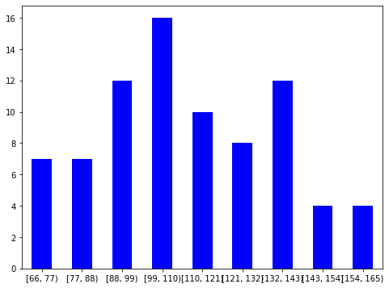
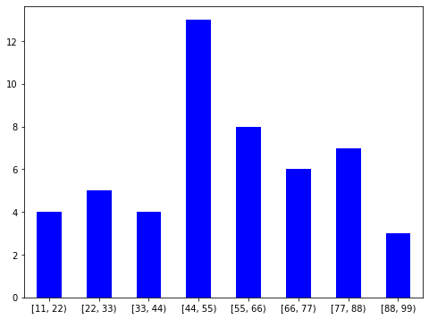

```python
import pandas as pd
from math import *
from pandas import Series as s
from pandas import DataFrame as df
import matplotlib.pyplot as plt
```


```python

```


```python
def plot_histogram(data):
    ax = data.value_counts(sort=False).plot.bar(rot=0, color="b", figsize=(8,6))
    ax.set_xticklabels([c for c in data.cat.categories])
    plt.show()

def bin_data(data, breedte):
    bins = [i * breedte for i in range(data.min()//breedte, data.max()//breedte + 2)]
    binned = pd.cut(data, bins=bins, right=False)
    return binned
```

Data kan verdeeld worden in deze categorieën:
	1. Kwantitatieve gegevens: cijfermatige gegvens die voorkomen op een numerieke schaal
		a. Continue: alle waarden uit een bepaalde range, infinite mogelijke waarden
		b. Discrete gegevens: Integer values
	2. Kwalitieve gegevens: Beschrijvende gegevens die alleen worden geclassificeerd in categorieën

Meetniveau:
Deze bepaalt welke statistische methode goed kunnen worden gebruikt om de meetgegevens te karakteriseren en interpreteren. De volgende worden onderscheden:
	1. Kwalitatief: 
		a. Nominaal: variabelen met waarden die alleen dienen om te onderscheiden. Vb(rood=1, groen = 2, blauw=3)
		b. Ordinaal: 
	2. Kwantitatief:
		a. Interval: variabel met vaste afstanden tussen waarden, maar geen vast nulpunt(tijd, temperatuur)
		b. ratio: variabelen met vast nulpunt(massa, lengte)
2 gebieden in statistiek: 
	1. Beschrijvend: uit ruwe data een overzicht maken. Grafische methoden gebruiken om patronen te ontdekken
Verklarend: gebruikt steekproefgegevens om beslissingen te kunnen nemen of schattingen te kunnen maken over een populatie!

__Populatie__: verzameling van objecten, personen of events waarvan gegevens vastgelegd worden.

__Aselecte steekproef__: een deelverzameling van de populatie die random gekozen is.
__Statistische gevolgtrekking__ : een schatting, voorspelling of generalisatie voor een populatie, gebaseerd op data uit de steekproef
__Betrouwbaarheidsmaat__ : een uitspraak over de mate van onzekerheid die gepaard gaat met een statistische gevolgtrekking.

__Experiment:__ een handeling of proces van waarnemingen die tot 1 enkele uitkomst leidt die net met zekerheid kan worden voorspeld.

__Uitkomst:__ een enkelvoudige gebeurtenis, de meest fundamentele uitkomst van een experiment

__Sample space/ uitkomstenruimte:__ de verzameling van alle mogelijke uitkomsten van een experiment

__Spreidingsbreedte(bereik)__: grooteste meetwaarde - kleinste meetwaarde
__Steekproef standaardafweiking:__ gelijk aan hoeveel een typische meting van de gegevensverzameling varieerd van de gemidelde  
__Variantie__ is gewoon $S^2$  
standaardafweiking heet $S$ voor steekproef std en $\sigma$ voor populatie std

__abs/rel freq.__: aantal waarneminfen die in een bep. klasse voorkomen, voor rel, deel door n  
__cum. rel. freq.__ : commulatief, tel de vorige antw op met de huidige

## Formules  
__Spreidingsbreedte(W)__ = max - min  
__n = aantal waarnemingen  
Standaardafweiking__ = 
$$S = \sqrt{{\frac{(\sum_1^n x i - avg )^2 }{n-1}}}$$
__Klassenbreedte__: $\frac{W}{\sqrt n}$, afgerond naar int. Lower side is inclusief, higher side is exclusive

__MODUS__ -> waarde met hoogste frequentie
__mediaan__ -> middelste waarde van gesorteerde tabel

## Opgaven
I. Beschouw de natuurlijke getallen van 1 t/m 100. Hieruit moet een aselecte steekproef ter grootte 2 worden getrokken, terwijl het ene getal even is en het andere oneven moet zijn. Geef 2 manieren hoe de steekproef tot stand kan komen.  
__ANSWER__: 
1. Split de getallen in even oneven, neem uit elke groep een random getal. 
2. neem een getal, neem daarna een ander getal en als beide (on)even zijn, trek 1 af van de laatste


II. Bij een onderzoekje naar het aantal kinderen per gezin neemt een leraar een steekproef bestaande uit de gezinnen waarvan hij kinderen in de klas heeft. Is deze wijze van steekproef nemen aselect of niet ?  
__ANSWER__ : niet aselect, er is een methode aan verbonden en is niet random. 

3. Van een 80-tal auto’s is het benzineverbruik bepaald. De volgende tabel geeft het aantal kilometers dat met  benzine werd afgelegd.

101 105   77   67   125   140   138   92   102   158   82   118   86
92     72   96   132    83   107   98   107   96   115   105   78
114   144   66   112   88   158   132   108   135   102  95    128
118   124   140   102   148   110   158   128   126   115   104   135
132   106   104   76   97   133   89   156   130   105   97   119
104   109   114   126   137   69   94   107   135   150   75   81
70   79   103   91   122   140   143   120

Maak en een klasseverdeling en maak een histogram van de klasseverdeling.


```python
data = df({'benzine': sorted([105, 77, 67, 125, 140, 138, 92, 102, 158, 82, 118, 86, 92, 72, 96, 132, 83, 107, 98, 107, 96, 115,
                     105, 78, 114, 144, 66, 112, 88, 158, 132, 108, 135, 102, 95, 128, 118, 124, 140, 102, 148, 110, 158,
                     128, 126, 115, 104, 135, 132, 106, 104, 76, 97, 133, 89, 156, 130, 105, 97, 119, 104, 109, 114, 126,
                     137, 69, 94, 107, 135, 150, 75, 81, 70, 79, 103, 91, 122, 140, 143, 120])})
breedte = (data["benzine"].max() - data["benzine"].min()) / sqrt(data["benzine"].size)
breedte = int(breedte) + 1

data['binned'] = bin_data(data.benzine, breedte)
print(data.binned.value_counts().sort_index())   
binned = bin_data(data.benzine, breedte)  
binned
plot_histogram(data.binned)
```

    [66, 77)       7
    [77, 88)       7
    [88, 99)      12
    [99, 110)     16
    [110, 121)    10
    [121, 132)     8
    [132, 143)    12
    [143, 154)     4
    [154, 165)     4
    Name: binned, dtype: int64
    





4. De tentamen-scores van 50 studenten zijn als volgt:
46   54   72   68   85   23   16   65   62   43
84   65   22   89   64   61   46   27   34   50
28   45   18   17   78   75   80   51   40   83
60   52   87   51   82   48   32   70   45   19
72   88   89   57   47   50   73   38   60   53

Maak een klasseverdeling en bereken ook de relatieve frequenties.
Maak een histogram van de cumulatieve relatieve frequentie.


```python
score = s(sorted([46, 54, 72, 68, 85, 23, 16, 65, 62, 43, 84, 65, 22, 89, 64, 61, 46, 27, 34, 50, 28, 45, 18, 17, 78, 75, 80, 51,
           40, 83, 60, 52, 87, 51, 82, 48, 32, 70, 45, 19, 72, 88, 89, 57, 47, 50, 73, 38, 60, 53, ]))
breedte = (score.max() - score.min())/ sqrt(score.size)
breedte = int(breedte) + 1
binned = bin_data(score, breedte)
binned.value_counts().sort_index()
plot_histogram(binned)
# too lazy to figure out how to do it cumulatively

```





5. Op 50 lagere scholen heeft men aselect één der 6e klassen gekozen en het aantal leerlingen geteld. De resultaten zijn als volgt.


aantal leerlingen	20	21	22	23	24	25	26	27	28	29	30  
frequentie	2	2	4	4	5	5	6	6	7	6	3

a. Wat is de modale waarde van het aantal leerlingen per klas ?
b. Maak een cumulatieve frequentietabel en bepaal hieruit de mediane waarde.
c. Bereken het gemiddelde en de standaardafwijking van het aantal leerlingen per klas.


```python
n = [20, 21, 22, 23, 24, 25, 26, 27, 28, 29, 30]
freq = [2, 2, 4, 4, 5, 5, 6, 6, 7, 6, 3]
newlist = []
for pos, f in enumerate(freq):
    for i in range(f):
        newlist.append(n[pos])
nstud = s(newlist)
nstud.describe()
```


    count    50.000000
    mean     25.700000
    std       2.779297
    min      20.000000
    25%      24.000000
    50%      26.000000
    75%      28.000000
    max      30.000000
    dtype: float64


```python
std = sqrt( sum((nstud - nstud.mean())**2) / (nstud.size - 1))
std
```


    2.779296636906245


6. Van 224 stukken geplastificeerd koperdraad is de dikte van de plastic omhulling gemeten. De frequentieverdeling van de resultaten is :

dikte	frequentie	dikte	frequentie	dikte	frequentie
146	3	151	33	156	11  
147	3	152	34	157	9  
148	7	153	37	158	2  
149	11	154	25	159	0  
150	25	155	23	160	1  

Bereken het gemiddelde en de standaardafwijking.
b. Bepaal de mediane waarde van de dikte.


```python
dikte = list(range(147, 161))
freq = [3, 7, 11, 25, 34, 37, 25, 23, 9, 2, 0, 1]
newlist = []
for pos, f in enumerate(freq):
    for i in range(f):
        newlist.append(dikte[pos])
diktes = s(newlist)
std = sqrt( sum((diktes - diktes.mean())**2) / (diktes.size - 1))
print(std)
diktes.describe()

```

    1.9554455590377737
    


    count    177.000000
    mean     151.728814
    std        1.955446
    min      147.000000
    25%      150.000000
    50%      152.000000
    75%      153.000000
    max      158.000000
    dtype: float64


```python

```
