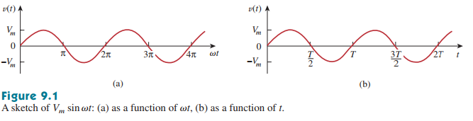
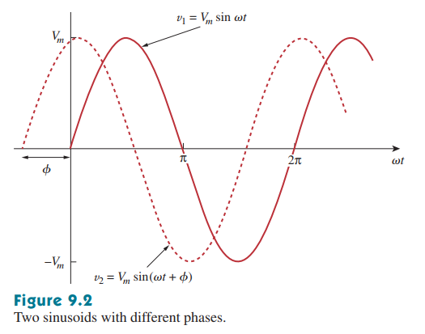
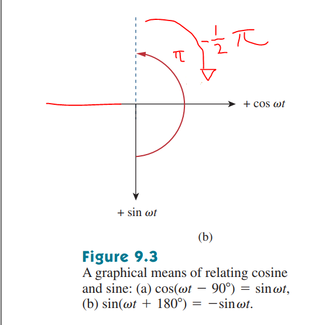
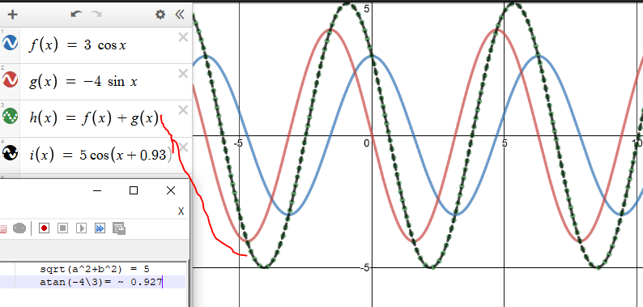
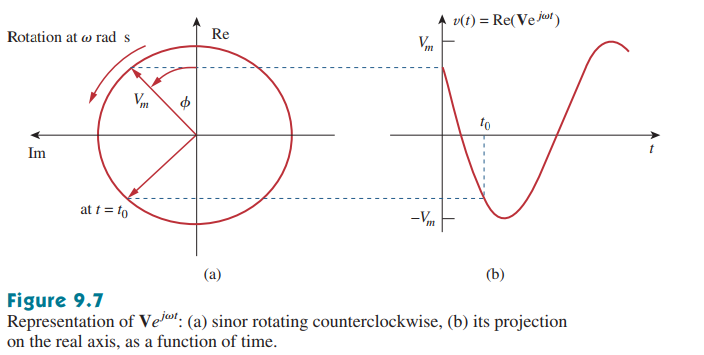
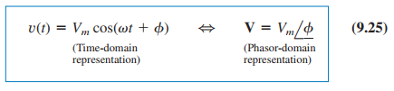
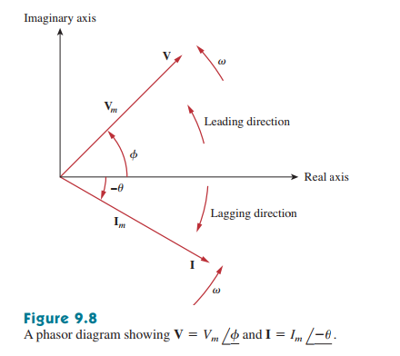
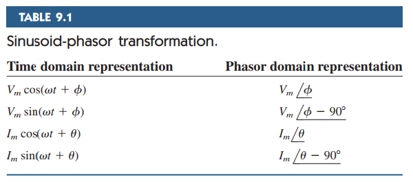
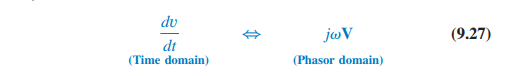

# Chapter 9, sinusoïdes en phasors

Tot nu toe hebben we alleen DC circuits geanalyseerd voor EN, circuits die gedreven worden door constante of tijd-invariante bronnen. Dit wordt gedaan om de basis concepten te introduceren en omdat deze makkelijker zijn om te analyseren. Nu beginnen we met het analyseren van circuits waar de voltage of stroom niet constant is. We beginnen met _sinusoïden_.

$$\text{Een sinusoïde is een signaal dat de form heeft van een (co)sinus functie}$$

Een sinusoide stroom wordt meestal AC _(Alternating current)_ genoemd, en circuits die gedreven worden door sinusoid stroom- en/of spanningsbronnen wonden _ac circuits_ genoemd.

We zijn geïnteresseerd in sinusoiden voor de volgende redenen:

1. De natuur is meestal sinusoide
2. Sinusoiden zijn makkelijk te genereren en transporteren
3. Elke periodiek signaal kan gerepresenteerd worden in een som van sinusoiden.
4. Sinusoiden zijn makkelijk algebraïsch te manipuleren, zowel de afgeleide als integraal zijn sinusoiden.

# 9.2 Sinusoiden

Overweeg de sinusoide voltage:

$$
\begin{aligned}
    v(t) V_m sin(\omega t) \tag{9.1}
\end{aligned}
$$

waar

$V_m =$ de _amplitude_ van de sinusoide  
$\omega =$ de _hoeksnelheid_ in rad/s  
$\omega t=$ de _argument_ van de sinusoide.

De sinusoide is te zien in fig 9.1(a) als functie van de argument en in fig 9.1(b) als functie van tijd.

  
Het is duidelijk te zien dat de functie zich herhaalt voor elke T seconden, oftewel T is de _periode_ van de sinusoide. We observeren dat $\omega T = 2 \pi$, oftewel

$$
\begin{aligned}
    T = {2 \pi \over \omega} \tag{9.2}
\end{aligned}
$$

$$
\begin{aligned}
    v(t + nT) = v(t) \tag{9.4}  \\
\end{aligned}
$$

$$
\text{Een periodische functie is ene functie waar EQ 9.4 voldoet voor alle t en n}
$$

Vanuit de periode T kunnen we de frequentie berekenen op de volgende manier.

$$
\begin{aligned}
    f = {1 \over T} \tag{9.5}
\end{aligned}
$$

Van EQ 9.2 + EQ 9.5 kunnen we afleiden dat

$$
\begin{aligned}
    \omega = 2 \pi f \tag{9.6}
\end{aligned}
$$

De algemene formule voor een sinusoide is

$$
\begin{aligned}
    v(t) = V_m sin(\omega t + \phi) \tag{9.7}
\end{aligned}
$$

waar $\omega t + \phi$ de argument is en $\phi$ de fase.

Laten we kijken naar 2 sinusoiden die te zien zijn in fig 9.2:

$$
\begin{aligned}
 (a) &: v_1(m) = V_m sin(\omega t) \\
 (b) &:   v_2(m) = V_m sin(\omega t + \phi)
\end{aligned}
$$

We kunnen zien dat $v_2$ eerder begint dan $v_1$, dus kunnen we zeggen dat $v_2 v_1$ leidt met $\phi$ ($v_2$ leads $v_1$ by $\phi$) of dat $v_1 v_2$ volgt met $\phi$ ($v_1$ lags behind $v_2$ by $\phi$). Als $\phi = 0$ kunnen we zeggen dat ze in fase zijn met elkaar, of dat ze hun min en max op dezelfde tijd bereiken. Indien $\phi \neq 0$, zeggen we dat ze uit fase zijn met elkaar. We kunnen dit doen omdat ze dezelfde frequentie hebben, maar ze mogen verschillende amplitudes hebben.

We kunnen sinusoiden uitdrukken in zowel sinus als cosinus form. Wanneer we meerdere sinusoiden vergelijken is het handig om ze in dezelfde form te hebben (een sin of cos met positieve amplitudes)

Dit zijn de relaties tussen sin en cos:

$$
\begin{aligned}
    sin(\omega t \pm \pi) &= - sin(\omega t) \\
    cos(\omega t \pm \pi) &= - cos(\omega t) \\
    sin(\omega t \pm 0.5 \pi) &= \pm cos(\omega t) \\
    cos(\omega t \pm 0.5\pi) &= \mp sin(\omega t) \\
\end{aligned}
$$

Maar dit is makkelijker te onthouden met deze grafiek:

Om een sinus en een cosinus op te tellen, kunnen we hetvolgende doen:

$$
\begin{aligned}
    A cos(\omega t) + B sin (\omega t) = C cos (\omega t - \theta) \tag{9.11}
\end{aligned}
$$

waar

$$
\begin{aligned}
    C &= \sqrt{A^2 + B^2} \tag{9.12} \\
    \theta &= arctan\left({B \over A}\right)
\end{aligned}
$$

# 9.3 PHASORS

Sinusoiden kunnen uitgedrukt worden in phasors, welke makkelijker mee te werken is dan met sinussen en cosinussen.

$$
\text{Een phasor is een complexe nummer dat de amplitude en fase van een sinusoide representeert.}
$$

Een complexe nummer $\mathcal{z}$ kan geschreven worden als rechthoekige form, polaire form, of exponentiele form.

$$
\begin{aligned}
    \Large{\mathcal{z}} &= x + jy \\ \tag{9.14}
    &= r \angle{\phi} \\
    &= r e^{j \phi} \\
    &= r (cos \phi + j sin \phi)
\end{aligned}
$$

waar $r = \sqrt{x^2 + y^2}, \phi=atan\left({y \over x}\right)$  
Als we $r, \phi$ kennen, dan kunnen we x en y krijgen door
$x = r cos (\phi), y = r sin(\phi)$. Check je analyse notes voor een more detailed explanation.

In het algemeen kunnen we zeggen dat :

1. optellen en aftrekken makkelijker zijn in rechthoekige form (a + bj)
2. vermenigvuldigen en delen makkelijker zijn in polaire form

$$
\begin{aligned}
    \text{optellen en aftrekken:} \\ \tag{9.18}
    Z_1 \pm Z_2 &= (x_1 \pm x_2) + (y_1 \pm y_2) \\
    \text{vermenigvuldigen:}  \\
    Z_1 \cdot Z_2 &= r_1\cdot r_2 \angle(\phi_1 + \phi_2) \\
     \text{delen:}  \\
    {Z_1 \over Z_2} &= {r_1\over r_2} \angle(\phi_1 - \phi_2) \\   \text{inverse:}  \\
    {1 \over Z} &= {1\over r} \angle(-\phi) \\
     \text{wortel:}  \\
    \sqrt{Z} &= \sqrt{r} \angle(\phi/2) \\
     \text{geconjugeerde:}  \\
    Z^* &= x - jy = r \angle -\phi \\

\end{aligned}
$$

Het concept van phasor representatie komt van Euler's formule, namelijk dat:

$$
\begin{aligned}
    e^{\pm j \phi} &= cos \phi \pm j sin \phi \\ \tag{9.19-20}
    20a&: cos \phi = Re(e^{j \phi}) \\
    20b&: sin \phi = Im(e^{j \phi}) \\
\end{aligned}
$$

De sinusoide $v(t) = V_m cos(jw + \phi)$ kunnen we schrijven als  
$v(t) = Re(V_m \cdot e^{jw + \phi}) = Re(V_m \cdot e^{jw} \cdot e^\phi)$

Dus:

$$
\begin{aligned}
    v(t) &= Re(Ve^{jwt}) \\ \tag{9.23,24}
    \text{waar} \\
    V &= V_m \cdot e^{jw} = V_m \angle \phi
\end{aligned}
$$

V is dus de phasor representatie van een sinusoide v(t), oftewel de complexe representatie van de grootte en fase van een sinusoide. We gebruiken meestal EQ9.20a om het om te zetten.

Een manier om te kijken naar EQ 9.23-24 is om het te plotten in de complexe vlak. Als tijd verandert, roteert de grafiek om de cirkel met r = $V_m$ met een hoeksnelheid $\omega$ tegen de klok in, zoals te zien is in FIG 9.7. We kunnen v(t) zien als een projectie van $Ve^{jw}$ op de reele as. Het is belangrijk om rekening te houden met de hoeksnelheid bij phasors, anders gaan we fouten maken.  
  
EQ 9.23 zegt basically dat om de sinusoide van een phasor V te krijgen, we de phasor moeten vermenigvuldigen met de tijdsfactor $e^{jw}$ en re reele deel ervan moeten nemen. Als een complexe ding, mogen we een phasor representeren in rectangular, polaire of exponentiele form.
Kijk naar de phasors **V** en **I** in fig 9.8, waar we de grafische representatie(phasor diagram) zien.
Door de tijdsfactor te supressen kunnen we van een sinusoide in de tijdsdomein gaan naar de phasor domein.  
  

Het concept van informatie uitdrukken in verschillende domeinen is fundamenteel voor engineering. Kijk hier naar de samenvatting vuur het transformeren vanuit een sinusoid naar een phasor.  

Hou in mind dat de frequentie(of tijds-) factor $e^{jw}$ niet expliciet gewezen wordt in de phasor domein, omdat $\omega$ constant is. Omdat de grootte wel afhankelijk is van $\omega$ zeggen we dat de phasor een frequentie domein is.

Van EQ 9.23, 24 weten we dat $v(t) = Re(Ve^{jwt}) = V_m cos(\omega t + \phi)$, dus

$$
\begin{aligned}
    {dv \over dt} &= \omega V_m cos (\omega t + \phi + 0.5 \pi) \\ \tag{9.26}
    &= Re(j \omega Ve^{jwt}) \\
    \text{(stappen overgeslagen,} \\
    \text{zie boek)}
\end{aligned}
$$

Dit toont aan dat v(t)' getransformeerd naar de phasor domein wordt als $jwV$(differentieren van v(t) is equivalent naar het vermenigvuldigen van de phasor met $j\omega$)  

Precies zo kunnen we de integraal van v(t) ook transformeren. Hierdoor wordt de phasor gedeelt door $j\omega$

$$
\begin{aligned}
    \int v dt \leftrightarrow {V\over j \omega} \tag{9.28}
\end{aligned}
$$

EQ 9.27-28 zijn handig voor het vinden van de steady-state, waar het niet nodig is om de beginwaardes te kennen. (oof, ik sense diff. eqs. voor transient state...)

Behalve makkelijke diff. en integratie is een andere usecase van phasors het optellen van sinusoiden met dezelfde freq. Dit is te zien in EXAMPLE 9.6.

De verschillen tussen v(t) en **V** zijn:

1. v(t) is de _tijdsdomein_ representatie, en **V** is de freq. of _phasor domein_ representatie
2. v(t) is afhankelijk van de tijd, maar **V** is niet.
3. v(t) is altijd reel, zonder complexe term, maar **V** is meestal complex.

Ten slotte is het belangrijk om bij te houden dat je phasor analyse alleen kan gebruiken als je frequentie, dus je $\omega$ constant blijft.
