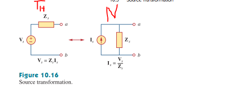
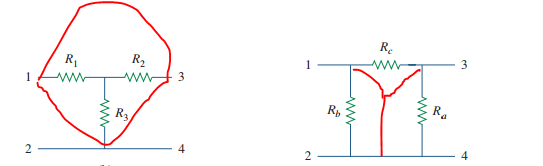
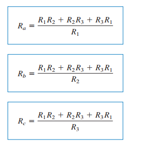

## Sinusoid to phasor

$A sin(\omega t + \theta) = A cos(\omega t + 90 + \theta) = A \angle (\theta + 90)$  
$B cos(w t + \theta) = B \angle \theta$  

## Phasor to sinusoid 

$(-r + j4)A 5 \angle 126.87 = 5 cos(wt + 126...)$  
$j8e^{-20} = j8 \angle-20 = (1\angle90)(9\angle-20) = 8 \angle 70$   
The $(1\angle 90)$ is omdat vermenigvuldigen met j gewoon roteren met 90 is.

# Differentieeren
$$
{dv \over dt} \rightarrow j \omega V
$$

# integreren
$$
\int v dt = {1\over j\omega} V = -j {1 \over \omega} V  
$$
(delen door j is vermenigvuldigen met -j)

# Rotatie van phasors met 90
$$
A = r e^{j \theta} \rightarrow Aj = r e^{j (\theta  + 90)}
$$
Basically, vermenigvuldigen met j is phase shiften met 90 graden.

# Solving of diffEqs with phasors, example
$$
\begin{aligned}
4 \Bbb{}{I} + 8 \int i dt - 3 {di \over dt} &= 50 cos( 2 t + 75) \\
4 I + 8 {1 \over j \omega} I - 3 j \omega I &= 50 \angle 75 \\
\text{since t is 2, and dividing by j is multiplying with -j,} \\
4 I - 4 I j - 6 I j &=  50 \angle 75 \\
I (4 - 10j) &= 50 \angle 75 \\
I = {50 \angle 75 \over 4 - 10j} &= 4,64 \angle 143
\end{aligned}
$$

# Phasor relationships

| element 	| Freq domain 	| Time domain 	|
|---------	|-------------	|-------------	|
| R       	|$\mathbb{V} = R \mathbb{I}$| V = Ri|
| L       	|$\mathbb{V} = jwL \mathbb{I}$|v = L ${di \over dt}$|
| C       	|$\mathbb{V} = {I\over jwC}$|i = C $dV \over dt$|

# Impedance
$$
\begin{aligned}
    Impedance(\mathcal{Z}) &= \mathbb{V \over I} = (Z_r + Z_L +Z_C ) \Omega \\
    \text{where:} \\
    \mathcal{Z_R} &= R \\
    \mathcal{Z_L} &= j\omega L \\
    \mathcal{Z_C} &= {1 \over j \omega C}
\end{aligned}
$$
We can alsso express z in complex rectangular form ($R + j x$) where x = reactance.  
Or we could just express it as $Z = |z| \angle \theta$

# Chapter 10
## KVL, KCL
KVL and KCL apply to phasors just the same.

Kramer's method might be easier to get the answer from the matrices.

### Kramer's method
given a 3x4 matrix(with say, v1, v2, v3, vals), take the determinant of the 3x3, call it D.
Then compute D1, D2, D3 by taking the determinant of the 3x4 matrix without the row( so D1, for V1 would have r2,r3, vals).
Then to get the v1, divide D1 by D and so on.
## Superposition theorem
Superpossition theorem works but with one important step: They must be added together in the time domain, not in the phasor domain when the sources have differing frequencies.

# source transformation, Thevenin and norton

If the circuit has sources that operate at different freqs, you must make norton or thevenin equivalents at all those freqs, not one for all freqs. See example 10.6

## Delta-Y transform

Om R1, R2 enz te berekenen, doe 
$${R_{adjacent} * R_{other\ adjacent}  \over R_a + R_b + R_c}$$
dus voor R1 komt $R_c * R_b$ erboven  

Each resistor in the Y network is the product of the resistors in the two adjacent branches, divided by the sum of the three resistors

Voor de reverse: 
Alle combinaties in de teller, en de $R_{opposite}$ in de teller

# Chapter 11, POWAAAAAAAAAA

## 11.2 
**Instantanious power** is the power at a specific moment, and is found like so:

P(t) = v(t) \cdot i(t) = 0.5 [cos (A+B) + cos (A-B)] 
, where b is something like (5t + 30)
This gives you P(t), where you then substitute t to get a value.

**Average power** is the average power over some time, and is defined as  
$P_{avg} = 0.5 V_m \cdot I_m cos(\theta_v - \theta_i)$

## 11.3
The max avg. power transfer ($P_{max}$) happens when the $\mathbb{Z}_L$ is the conjugate of $\mathbb{Z}_{Th}$.
So when $\mathbf{Z}_L = \overline{\bar{Z_{Th}}}$

The max power thansfer(when Z is complex) is 
$$
P_{max} = {\lVert V_{Th} \rVert^2\over 8 R_{Th}}
$$

When $Z_L$ is only real (so $R_L$), use $P_{max} =0.5 \lVert \mathbb{I} \rvert^2 R_L$ instead.

## 11.4 RMS
$$
X_{rms} = \sqrt{{1\over T} \int_0^Tx^2dt}
$$ 

where X and x are the voltage, current, etc.

## 11.5 
The apparent power(in VA) is $V_{rms} \cdot I_{rms}(\theta_v - \theta_i)$  

Power factor(pf) = $cos(\theta_v - \theta_i)$

## 11.6
$$
\begin{aligned}
\text{complex power } \textbf{S} &= P + jQ = V_{rms} I_{rms} * = V_{rms} I_{rms} \angle(\theta_v - \theta_i)  \\
\text{Apearent power} S &= \lVert \textbf{B} \rVert = \sqrt{P^2 + Q^2} \\
Real power P &= Re(\textbf{S}) = S \cdot \text{power factor} \\
Feactive power &= Im(\textbf{S}) = S \cdot sin(\theta_v - \theta_i)
    
\end{aligned}

$$

## 11.7
The complex, real, and reactive powers of the sources equal the respective sums of complex, real, reactive powers of individual laods/elements.

